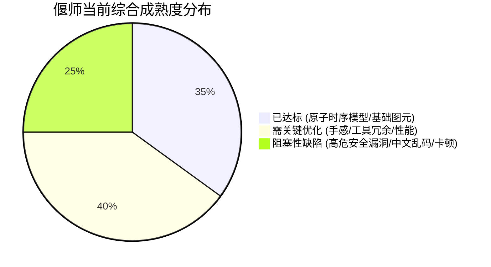
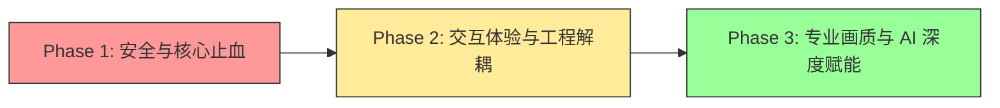

# 偃师 Yanshi 架构审查与全景评估总览报告（Executive Summary）

**审查基准**：当前工作区 `main` 分支（提交 `28f6856`）  
**代码规模**：123,222 行源码（Rust + 内嵌 Web Viewer）  
**审查定位**：AI MCP 调用创作、人类 Web 创作交互、核心数据模型与存储、渲染管线与笔刷动力学、WASM 介质插件、网络安全与运维、专业软件定位与工程质量。  
**产出系列文档**：`code-review/01-mcp-ai-creation.md` ~ `code-review/07-product-positioning-engineering.md`。

---

## 1. 总体审查结论与技术评级

偃师 Yanshi 展现出极其前沿且雄心勃勃的架构愿景：**将图像编辑抽象为只追加的不可变原子时序事实（Append-only Atom Log），并基于 Rust 纯计算内核与 WebAssembly 实现服务端与浏览器端的双端同构（D0 权威基线）**。其在参数归一化、不可变变更集（Changeset）及无头化工具协议设计上做了大量扎实探索。

然而，立足于**“专业绘画作图软件”**和**“AI 原生创作引擎”**的高标准，当前代码库在安全边界、交互手感、算法复杂度、色彩科学及工程组织上存在一系列阻碍其走向生产可用的严重缺陷与技术债务：

### 各维度评级矩阵

| 审查维度 | 对应专项报告 | 成熟度评级 | 核心卡点 / 关键风险 |
|---|---|:---:|---|
| **AI MCP 创作与调用** | `01-mcp-ai-creation.md` | **C+** | 114 个工具致上下文过载；颜色输入存在暗色放大 255 倍的启发式歧义；MCP 消息切片风险 |
| **人类 Web 交互体验** | `02-web-human-creation-ux.md` | **D** | 逐 dab 同步 `getImageData` 导致严重掉帧；滚轮被全局吞没但提示却教用户用滚轮；丢失数位板采样点 |
| **核心数据模型与存储** | `03-core-data-model-persistence.md` | **B-** | `can_extend` 存在无用全量扫描死代码退化为 $O(N\log N)$；无日志压缩，长会话内存无界膨胀 |
| **渲染管线与笔刷引擎** | `04-render-brush-engine.md` | **C-** | 仅 5x7 ASCII 点阵字，**所有中文强制变问号**；纯 CPU 标量循环缺 SIMD；无 16-bit 导致色阶断层 |
| **WASM 介质插件系统** | `05-wasm-medium-plugins.md` | **C** | 名义 WASM 插件，实则服务端原生静态写死 6 个介质；全局串行锁 `MEDIUM_LOCK` 扼杀并发吞吐 |
| **网络服务与系统安全** | `06-http-security-ops.md` | **F (极危)** | **P0 级任意文件写入/覆盖漏洞**；无鉴权开立 Editor Token；缺失 Origin 校验导致 CSWSH 跨站劫持 |
| **产品定位与工程质量** | `07-product-positioning-engineering.md` | **D+** | tools.rs(12k行)、viewer.rs(7.8k行)超大单文件失控；盲目零依赖自制简陋轮子引发严重技术负债 |

---

## 2. Top 10 最致命缺陷与核心风险一览

| 编号 | 严重度 | 缺陷位置与标题 | 核心影响 | 修复紧迫性 |
|:---:|:---:|---|---|:---:|
| **1** | **P0** | [`tools.rs:11409`](file:///home/crow/yanshi/crates/yanshi-server/src/tools.rs#L11409) `export_png` / `export_project` 任意文件覆盖 | 客户端传入绝对路径，服务端直接 `std::fs::write`，攻击者可覆盖宿主机任意关键系统配置或文件 | **最高 (CVE级)** |
| **2** | **P0** | [`server.rs:650`](file:///home/crow/yanshi/crates/yanshi-http/src/server.rs#L650) `/api/documents` 匿名签发 Editor 令牌 | 任何人无须密码或 API-Key 即可获取最高写权限令牌，结合 #1 形成完整的未授权提权/系统破坏攻击链 | **最高 (越权)** |
| **3** | **P0** | [`font.rs:1-60`](file:///home/crow/yanshi/crates/yanshi-render/src/font.rs#L1-L60) 文本渲染仅支持 5×7 ASCII 点阵 | **所有中文（汉字）及 Emoji 强制渲染为问号 `?`**，无法用于任何严肃的平面排版或海报设计 | **最高 (功能残缺)** |
| **4** | **P0** | [`seq.rs:400`](file:///home/crow/yanshi/crates/yanshi-core/src/seq.rs#L400) `can_extend` 中隐藏全量扫描死代码 | 无意义地调用 `compute_suppressed` 全量扫描上万条历史，原本 $O(M)$ 的增量折叠严重退化为 $O(N\log N)$ | **高 (性能退化)** |
| **5** | **P0** | [`viewer.rs:2260`](file:///home/crow/yanshi/crates/yanshi-http/src/viewer.rs#L2260) 运笔循环高频同步调用 `getImageData` | 每一枚 dab 印章强制触发 GPU 显存回读与 Pipeline Stall，造成交互帧率断崖式暴跌，运笔严重卡死 | **高 (交互阻塞)** |
| **6** | **P0** | [`color.rs:308`](file:///home/crow/yanshi/crates/yanshi-render/src/color.rs#L308) 颜色解析“暗色被放大 255 倍”歧义炸弹 | 任意分量 $\le 1.0$ 的深色数组被误判为线性 0..1 浮点，AI 意图绘制微暗色直接变成饱和纯亮色 | **高 (AI幻觉诱因)** |
| **7** | **P0** | [`viewer.rs:5610`](file:///home/crow/yanshi/crates/yanshi-http/src/viewer.rs#L5610) 滚轮被吞没但提示教用户滚轮的逻辑死锁 | 页面拦截所有 wheel 事件导致滚轮缩放失效，但在视口受限时日志提示“用滚轮放大”，体验严重割裂 | **高 (用户体验)** |
| **8** | **P1** | [`medium-host/src/lib.rs:25`](file:///home/crow/yanshi/crates/yanshi-medium-host/src/lib.rs#L25) 介质宿主伪 WASM 沙箱与全局串行锁 | 服务端将 6 个介质原生写死，无法热插拔第三方插件；`MEDIUM_LOCK` 强行将全服多文档介质渲染单线程化 | **中 (架构瓶颈)** |
| **9** | **P1** | [`server.rs:1050`](file:///home/crow/yanshi/crates/yanshi-http/src/server.rs#L1050) WebSocket 升级缺少 Origin 检查 (CSWSH) | 恶意网站可发起跨源 WebSocket 连接，静默窃取本地正在绘制的画布或注入破坏性操作 | **高 (安全风险)** |
| **10** | **P1** | [`tools.rs`](file:///home/crow/yanshi/crates/yanshi-server/src/tools.rs) (12k行) 与 [`viewer.rs`](file:///home/crow/yanshi/crates/yanshi-http/src/viewer.rs) (7.8k行) 巨型单文件债务 | 缺乏模块化与自动化构建管线，微小修复反复引发隐蔽回归，代码处于极高维护风险期 | **高 (可维护性)** |

---

## 3. 分册审查报告索引导航

各专题领域包含细致到行号的代码片段、故障机理推导、实测依据及重构建议：

- [**01. AI MCP 调用创作与反复修改专项审查**](01-mcp-ai-creation.md)
  - *重点*：MCP 协议合规度、114 个工具上下文过载、颜色模式歧义陷阱、撤销与微调工作流、视觉反馈闭环缺失。
- [**02. 人类 Web 创作体验与前端交互架构专项审查**](02-web-human-creation-ux.md)
  - *重点*：数位板压感与事件丢弃、逐 dab 像素回读瓶颈、滚轮交互矛盾、专业功能对标（Krita/Procreate）。
- [**03. 核心数据模型、CRDT 与持久化架构专项审查**](03-core-data-model-persistence.md)
  - *重点*：增量求值算法复杂度退化分析、未引用 Blob 误删竞态、超长日志压缩与内存膨胀、D0 浮点一致性。
- [**04. 渲染管线与笔刷动力学引擎专项审查**](04-render-brush-engine.md)
  - *重点*：5×7 ASCII 点阵文字缺陷、SIMD 与多线程缺失分析、8-bit 色阶断层、L3 瓦片缓存抖动、PSD 互通缺陷。
- [**05. WASM 介质插件与物理仿真专项审查**](05-wasm-medium-plugins.md)
  - *重点*：伪 WASM 沙箱机理、全局串行锁瓶颈、油画/水彩物理仿真真实度对比、二进制入库风险。
- [**06. 网络服务、网络安全与运维架构专项审查**](06-http-security-ops.md)
  - *重点*：P0 级任意文件覆写攻击链、无鉴权开立 Editor 越权、CSWSH 跨站劫持、每连接一线程 DoS 风险。
- [**07. 专业绘画/作图软件定位与工程质量专项审查**](07-product-positioning-engineering.md)
  - *重点*：行业软件能力矩阵差距、设计与实现偏离诊断、上万行单文件债务、“盲目零依赖”质量反噬、三阶段演进路线图。

---

## 4. 关键演进路径战略建议

要将偃师打造成真正具备工业竞争力的 AI 原生专业绘画软件，建议按如下三个阶段推进改造：

1. **第一阶段：安全止血与核心除虫（1~2 周）**
   - 封堵 `export_png` / `export_project` 任意路径写入漏洞，实行沙箱隔离。
   - 引入主鉴权密钥与 WebSocket Origin 白名单。
   - 剔除 `seq.rs:400` 的 `compute_suppressed` 全量扫描死代码。
   - 修复颜色输入二义性，规范 Schema。

2. **第二阶段：交互重构与工程拆解（1~2 个月）**
   - 前端 `viewer.rs` 彻底移出 Rust 仓库，建立基于 TypeScript + Vite 的独立现代 Web 工程。
   - 废除同步 `getImageData`，采用阴影内存缓冲，恢复数位板高频事件并修正滚轮交互。
   - 集成纯 Rust 矢量字体光栅化器，提供完整的 CJK 中文字体显示与排版支持。
   - 将 12k 行的 `tools.rs` 拆分为清晰的领域子模块。

3. **第三阶段：专业渲染与下一代 AI 协作（3~6 个月）**
   - 核心合成层升级为 16-bit 浮点并引入 SIMD / Rayon 向量化多核并发。
   - 实现轻量级服务端 WASM 沙箱（移除全局串行锁），支持真正开放的第三方物理介质扩展。
   - 精简专供 AI 的创作 Profile，建立局部高清切片（ROI）与视觉结构感知的闭环迭代工作流。
