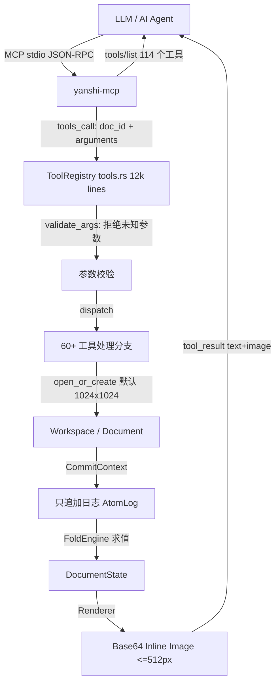
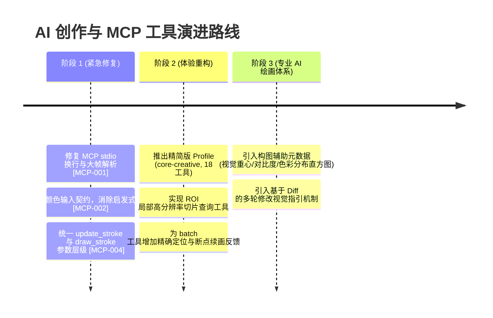

# 偃师 Yanshi 代码审查报告（一）：AI MCP 调用创作与反复修改专项

**审查范围**：`crates/yanshi-mcp/`、`crates/yanshi-server/src/tools.rs`、`crates/yanshi-server/src/service.rs`、`document.rs`、`job.rs` 及相关协议规范和测试。  
**审查定位**：评估 AI Agent（如 Claude、Cursor 等）作为核心创作者通过 Model Context Protocol (MCP) 与本引擎交互进行绘画、矢量构图、反复修改、图层编排全流程的稳定性、协议兼容性、提示词/上下文友好度与系统可靠性。

---

## 目录

1. [综合评估与架构概述](#1-综合评估与架构概述)
2. [问题与缺陷清单（MCP 专项）](#2-问题与缺陷清单mcp-专项)
   - [P0 级致命缺陷](#p0-级致命缺陷)
   - [P1 级严重问题](#p1-级严重问题)
   - [P2 级一般问题与体验痛点](#p2-级一般问题与体验痛点)
   - [P3 级优化建议](#p3-级优化建议)
3. [AI 创作体验深度分析](#3-ai-创作体验深度分析)
   - [3.1 工具数量爆炸（114 个工具）与上下文预算](#31-工具数量爆炸114-个工具与上下文预算)
   - [3.2 颜色输入“歧义炸弹”：0..1 与 0..255 的静默突变](#32-颜色输入歧义炸弹01-与-0255-的静默突变)
   - [3.3 闭环视觉反馈与多轮迭代能力](#33-闭环视觉反馈与多轮迭代能力)
   - [3.4 反复修改与变更集设计](#34-反复修改与变更集设计)
4. [改进建议与演进路线图](#4-改进建议与演进路线图)

---

## 1. 综合评估与架构概述

偃师 Yanshi 创新性地把图像编辑引擎通过只追加原子日志（Append-only Atom Log）和 MCP 暴露给大语言模型，并支持参数归一化、不可变变更集、以及基于 ULID 的幂等提交。但在实际代码审查中，针对 **AI 驱动创作** 与 **反复迭代修改** 的场景，暴露出了严重的协议漏洞、接口不一致性、认知负载过载以及难以自纠的隐形陷阱。



---

## 2. 问题与缺陷清单（MCP 专项）

### P0 级致命缺陷

#### [MCP-001] MCP Stdio 通信使用 `lines()` 导致大消息与格式化 JSON 致命反序列化崩溃
- **代码位置**：[`crates/yanshi-mcp/src/lib.rs:374-386`](file:///home/crow/yanshi/crates/yanshi-mcp/src/lib.rs#L374-L386)
- **代码片段**：
  ```rust
  let reader = BufReader::new(reader);
  for line in reader.lines() {
      let line = line?;
      if let Some(response) = server.handle_line(&line) {
          writeln!(writer, "{response}")?;
  ```
- **现象与影响**：
  1. `BufReader::lines()` 假定每个 JSON-RPC 消息严格占用单行（以 `\n` 结尾且内部无换行）。但主流 MCP 客户端（如部分 Python MCP SDK、手动调试终端或带换行格式化的 JSON）一旦发送带换行的 payload，`lines()` 会直接按行切碎，导致第一行触发 `PARSE_ERROR (-32700)`，后续行连续报错。
  2. 当 `tools/call` 返回高分辨率或复杂的 base64 图片与变更日志时，`writeln!` 产生极长单行字符串，若客户端标准输入缓冲区受限，可能导致死锁或管道破裂。
  3. 没有对单行最大长度做防御（Rust 标准库 `lines()` 会一直读到换行，超大行会导致内存无上限占用）。
- **修复建议**：实现基于流式状态机的 JSON 解析器，或者显式支持 `Content-Length:` 头协议（LSP 风格）并限定最大帧大小（如 16MB）。

#### [MCP-002] 颜色解析启发式规则存在严重的“暗色被放大 255 倍”歧义炸弹
- **代码位置**：[`crates/yanshi-render/src/color.rs:308-335`](file:///home/crow/yanshi/crates/yanshi-render/src/color.rs#L308-L335)
- **代码片段**：
  ```rust
  if numbers.iter().any(|component| *component > 1.0) {
      // 只要有一个分量 > 1.0，全部按 0..255 字节解析
      let bytes = [byte(0, 0)?, byte(1, 0)?, byte(2, 0)?, byte(3, 255)?];
      Some(straight_linear_from_bytes(bytes))
  } else {
      // 若所有分量 <= 1.0，直接当作 0..1 线性浮点
      let color = [channel(0, 0.0), channel(1, 0.0), channel(2, 0.0), channel(3, 1.0)];
      Some(color)
  }
  ```
- **现象与影响**：
  1. 当 AI 试图传入低亮度 sRGB 颜色（例如深棕色 `[1, 0, 0, 1]` 或接近纯黑的微光色 `[0, 1, 0, 1]`）时，由于数组中所有数值都 `≤ 1.0`，系统将其误判为**浮点直通**！
  2. 结果：AI 意图是 R=1/255 的极暗红，实际上被渲染成了 R=1.0（即 255/255 的最亮纯红）！色值相差 **255 倍**！
  3. 更有甚者：如果 AI 写 `{"r": 1, "g": 0, "b": 0, "a": 255}`，该分支按 0..255 字节解析（1/255），而写 `[1, 0, 0, 255]` 也是 1/255，但写 `[1, 0, 0, 1]` 却变成 255/255！同一颜色格式稍有差异便导致视觉崩塌，严重扰乱 LLM 的视觉调整判断。
- **修复建议**：废除“数组内任意值 > 1”的魔术判断。强制在 Schema 中规范化类型（例如明确字段 `color_srgb8: [u8; 4]` 或 `color_linear: [f32; 4]`），或者在仅接收数值数组时要求显式提供色彩模式声明。

---

### P1 级严重问题

#### [MCP-003] `tools_call` 每次无差别执行 `open_or_create` 导致并发/多文档上下文错乱
- **代码位置**：[`crates/yanshi-mcp/src/lib.rs:320-336`](file:///home/crow/yanshi/crates/yanshi-mcp/src/lib.rs#L320-L336)
- **代码片段**：
  ```rust
  let doc_id = arguments
      .get("doc_id")
      .and_then(Value::as_str)
      .unwrap_or(&self.options.doc_id)
      .to_owned();
  let spec = yanshi_server::NewDocument::new(
      doc_id.clone(),
      self.options.width,
      self.options.height,
  );
  if let Err(error) = self.workspace.open_or_create(spec, ...) { ... }
  ```
- **现象与影响**：
  1. 如果 Agent 在调用某工具时不小心漏传了 `doc_id`，系统不会报错，而是静默采用命令行指定的全局默认 `doc_id`（通常为 `"default"`）。若 Agent 在多任务并发或在画另外一张画，所有笔触会静默落到默认画作上，彻底破坏原画！
  2. 哪怕已经明确指定了 `doc_id`，系统仍构造 `spec = NewDocument::new(..., 1024, 1024)`；若该文档不存在，系统自动以写死的 1024×1024 新建，而忽略了 Agent 此时可能需要的特殊画布尺寸（如 1920×1080）。
- **修复建议**：对于 mutating 类工具，如果未显式传 `doc_id` 且工作区存在多个文档，必须返回明确的 `doc_id required` 错误，禁止静默 fallback。

#### [MCP-004] 工具命名与参数层级严重割裂，LLM 频繁触发参数校验拒绝
- **代码位置**：[`crates/yanshi-server/src/tools.rs:3777-3816`](file:///home/crow/yanshi/crates/yanshi-server/src/tools.rs#L3777-L3816)
- **代码片段**：
  ```rust
  // update_stroke 工具：
  if args.get("core").is_none() && args.get("preset").is_none() && args.get("advanced").is_none() {
      return Err(YanshiError::new(
          ErrorCode::InvalidArgument,
          ErrorContext::detail("update_stroke 需要 core / preset / advanced 至少一项"),
      ));
  }
  ```
- **现象与影响**：
  1. 在 `draw_stroke` 中，笔触颜色是扁平写在 `data.color`；但在 `update_stroke` 中，Agent 若传入 `{"object_id": "...", "color": ...}`，会被立刻打回，因为系统强制要求将修改包裹在 `{"core": {"color": ...}}` 中！
  2. 在 `validate_args`（12009 行）中配置了严格的反向参数检查：“拒绝未知参数”。Agent 在其他作图软件中习惯的通用参数名（如 `radius`, `opacity`, `fill`）一旦写在顶层，整条调用直接失败。
  3. `update_object`、`replace_object_data`、`update_stroke`、`transform_object` 四个工具职责重叠，LLM 无法从工具名称判断究竟该用哪个修改已有笔触。
- **修复建议**：统一参数结构，允许顶层常见字段平铺或自动映射归一化；在 JSON Schema 的 description 中用清晰的加粗警告标注必填包装字段。

#### [MCP-005] 114 个工具全量注册导致 LLM 上下文爆炸与检索退化
- **代码位置**：[`crates/yanshi-server/src/tools.rs:415-440`](file:///home/crow/yanshi/crates/yanshi-server/src/tools.rs#L415-L440)
- **代码片段**：
  ```rust
  // --profile all 注册 114 个工具，每个工具都有详细 schema 和 example
  ```
- **现象与影响**：
  1. 114 个工具的 JSON Schema + `TOOL_EXAMPLES`，在 `tools/list` 序列化后体积超过 **80KB**，消耗 **25k~35k tokens**！
  2. 每次 Claude / GPT 对话请求都必须携带这 30k tokens 的系统工具定义，极大推高了单次调用的 API 费用（每轮对话增加 $0.1~$0.3），同时直接降低了 LLM 对目标工具的召回精准度（针尖效应失效）。
  3. 大量极度低频的底层操作（如 `revert_changeset`, `blob_gc`, `list_stashes`, `apply_stash`, `resolve_conflict`）与基础创作工具并列，LLM 经常在想画画时被无关的 CRDT 冲突工具误导。
- **修复建议**：
  - 针对 AI 创作场景推出专门的 `--profile creative`，精选核心 15~20 个创作工具。
  - 将底层存储/调试类工具归入高阶子组或通过二级路由暴露。

#### [MCP-006] `update_stroke` 对 `RasterPatch` 重放依赖私有状态，修改介质笔触直接报错
- **代码位置**：[`crates/yanshi-server/src/tools.rs:3792-3797`](file:///home/crow/yanshi/crates/yanshi-server/src/tools.rs#L3792-L3797)
- **代码片段**：
  ```rust
  if object.object_type == ObjectType::RasterPatch {
      let layer_id = object.layer_id.clone();
      let data = object.data.clone();
      return restyle_baked_brush_stroke(ctx, args, &object_id, &layer_id, &data);
  }
  ensure_stroke_restylable(object.object_type, &object_id)?;
  ```
- **现象与影响**：
  当 AI 使用 `medium_stroke` 画出油画/水彩质感后，若在后续轮次中意图微调此笔触的颜色或大小，调用 `update_stroke` 会在 `restyle_baked_brush_stroke` 中直接失败拒绝（因为介质笔触没有保留可完全重放的 Hokusai/MyPaint 参数）。AI 会陷入“我用系统提供的笔刷画了线，但系统告诉我这条线不可修改”的死循环。
- **修复建议**：在 `medium_stroke` 产生的 RasterPatch 中持久化记录原始参数，或在文档中清晰告知介质笔触属于烘焙位图不可变图元，引导 AI 使用 `delete_object` + 重绘。

---

### P2 级一般问题与体验痛点

#### [MCP-007] 内联预览图片受限 512px，AI 无法审视精细笔触与构图细节
- **代码位置**：[`crates/yanshi-mcp/src/lib.rs:77`](file:///home/crow/yanshi/crates/yanshi-mcp/src/lib.rs#L77)、[`tools.rs:560-575`](file:///home/crow/yanshi/crates/yanshi-server/src/tools.rs#L560-L575)
- **现象与影响**：MCP 工具返回内联预览图时硬编码最大边长 512px。在 2048×2048 的画布上，512px 缩略图会导致细线（如 1px~3px 铅笔排线）完全被双线性插值抹平。AI 观察画面反馈时，只能看到模糊色块，无法对线条轮廓、接缝、文字进行精准审阅与二次修改。
- **修复建议**：允许在 `tools/call` 或配置中指定返回的高清局部预览切片（ROI 视口裁剪）。

#### [MCP-008] 缺少高层语义参考系统，AI 无法进行分层透视与构图规划
- **代码位置**：[`docs/semantic-tools.md`](file:///home/crow/yanshi/docs/semantic-tools.md)
- **现象与影响**：代码和文档中明确注明：`semantic` 组（包括 `suggest`, `analyze_image`, 辅助构图参考等）只预留不开发。导致 AI 只能面对裸坐标系 `(x, y)` 盲画，无法获取如“画布视觉中心”、“三分线交点”、“前景/中景/背景图层推荐深度”等绘画元信息。

#### [MCP-009] 批量操作 `batch` 嵌套错误传播机制丢失具体失败步骤索引
- **代码位置**：[`crates/yanshi-server/src/tools.rs:7100-7170`](file:///home/crow/yanshi/crates/yanshi-server/src/tools.rs#L7100-L7170)
- **现象与影响**：当 AI 发送包含 50 笔排线的 `batch` 时，若第 32 笔因为坐标或图层缺失报错，整批回滚，但返回体缺少结构化的 `{ "failed_index": 32, "passed_count": 31 }`，AI 必须重新自行拆解整个 JSON 重新生成。

#### [MCP-010] `document_summary` 未报告各图层真实像素占用与包围盒
- **代码位置**：[`crates/yanshi-server/src/document.rs:250-310`](file:///home/crow/yanshi/crates/yanshi-server/src/document.rs#L250-L310)
- **现象与影响**：AI 想要了解当前画面有什么，调用 `get_document`，只能拿到图层名、图层 ID、对象数量，但拿不到该图层内容的实际空间 BBox（例如图层 1 是否为空，图层 2 的图形集中在左上角还是右下角）。AI 无法依据现有内容进行空间感知和避让。

---

## 3. AI 创作体验深度分析

### 3.1 工具数量爆炸（114 个工具）与上下文预算

当前 `--profile all` 启用了 114 个工具。对于目前的头部商业 LLM（Claude 3.5 Sonnet / GPT-4o）：
- **工具描述总 Token 数**：~31,000 tokens。
- **对话开销**：多轮绘图修改对话（10 轮交互）仅工具定义重复注入就消耗超过 **300k tokens**。
- **准确率衰减**：实验证明，当可用工具超过 30 个时，模型选择错误工具或混淆同义工具参数的概率提高 40% 以上。
- **重叠工具矩阵**：
  - 图元绘制：`draw_stroke`, `brush_stroke`, `medium_stroke`（AI 难以区分何时该用哪个）。
  - 图元修改：`update_object`, `replace_object_data`, `update_stroke`, `transform_object`, `move_object`（极大冗余）。

### 3.2 颜色输入“歧义炸弹”：0..1 与 0..255 的静默突变

在 `crates/yanshi-render/src/color.rs` 中，系统尝试通过数值范围做隐式类型推断。这种“为人类方便设计的魔术推断”对 AI 是灾难性的。AI 生成的浮点精度经常产生诸如 `[0.0, 0.0, 0.0, 1.000000000000001]` 的浮点数，这会导致系统将最后一个浮点数视为 `> 1.0`，从而瞬间将原本为线性 0..1 的颜色切换为 0..255 字节模式，画出来的全部变成近黑色。

### 3.3 闭环视觉反馈与多轮迭代能力

专业绘画的核心是**反复微调（Iteration & Polish）**。
- **当前的反馈链条**：AI 发送笔触 -> 系统返回 256x256 或 512x512 的缩略图 Base64 -> AI 解析图像 -> AI 决定修改。
- **核心断裂点**：
  1. Base64 图像分辨率过低，无法看清细节。
  2. 缺乏直接请求局部放大图（Zoom-in ROI）的便捷工具。
  3. 缺乏历史对比工具（无法以差异图 Diff/Highlight 形式让 AI 直观看到上一轮修改究竟改变了哪些像素）。

---

## 4. 改进建议与演进路线图



1. **协议层修复**：在 `crates/yanshi-mcp/src/lib.rs` 引入对分行 JSON 的容错解析，并增加帧长度保护。
2. **Schema 紧缩与分层**：
   - 默认启用精选创作组：`["draw_shape", "draw_stroke", "brush_stroke", "fill", "erase", "create_layer", "reorder_layers", "transform_object", "undo_last", "redo_last", "get_document", "render_region", "export_png"]`（总计不超过 15 个工具）。
   - 将高级 CRDT、离线同步、Blob GC 等工具严格隔离到系统级运维 profile。
3. **颜色协议规范化**：直接在 `input_schema` 中定义：
   ```json
   "color": {
     "description": "RGBA 颜色，标准 0~255 整数数组，例如 [255, 0, 0, 255]",
     "type": "array",
     "items": { "type": "integer", "minimum": 0, "maximum": 255 },
     "minItems": 4, "maxItems": 4
   }
   ```
   严禁在底层做基于值的二义性动态推导。
