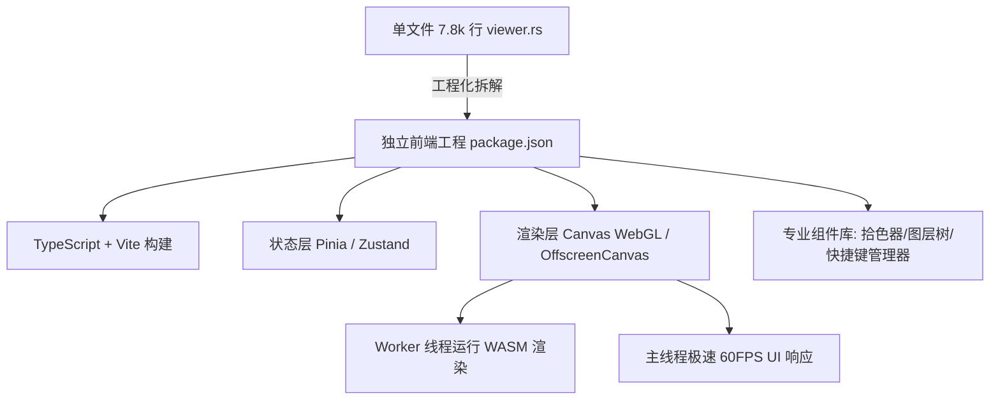

# 偃师 Yanshi 代码审查报告（二）：人类 Web 创作体验与前端交互架构专项

**审查范围**：`crates/yanshi-http/src/viewer.rs`（7,864 行单文件内嵌 Web 前端）、`crates/yanshi-http/src/server.rs`、`crates/yanshi-http/src/ws.rs`、`crates/yanshi-wasm/`。  
**审查定位**：评估专业插画师、数字艺术家及普通创作者在浏览器端进行实际绘画、反复图层调整、手势操作、笔刷调优及大画布长时创作的实际体验与底层交互质量。

---

## 目录

1. [综合评估与交互体验总览](#1-综合评估与交互体验总览)
2. [问题与缺陷清单（Web 体验专项）](#2-问题与缺陷清单web-体验专项)
   - [P0 级致命缺陷](#p0-级致命缺陷)
   - [P1 级严重交互阻碍](#p1-级严重交互阻碍)
   - [P2 级体验退化与功能残缺](#p2-级体验退化与功能残缺)
   - [P3 级易用性与界面抛光建议](#p3-级易用性与界面抛光建议)
3. [绘画手感与数位板支持深度分析](#3-绘画手感与数位板支持深度分析)
   - [3.1 数位板高频事件丢失与阶梯状锯齿](#31-数位板高频事件丢失与阶梯状锯齿)
   - [3.2 滚轮事件“吞没”与界面提示自相矛盾](#32-滚轮事件吞没与界面提示自相矛盾)
   - [3.3 逐 Dab 同步 `getImageData` 造成的极度掉帧](#33-逐-dab-同步-getimagedata-造成的极度掉帧)
   - [3.4 “.myb 笔刷拖动画时无墨”与网络盲画](#34-myb-笔刷拖动画时无墨与网络盲画)
4. [与专业绘画软件（Photoshop / Krita / Procreate）功能差距对照表](#4-与专业绘画软件photoshop--krita--procreate功能差距对照表)
5. [前端工程化改造方案](#5-前端工程化改造方案)

---

## 1. 综合评估与交互体验总览

`crates/yanshi-http/src/viewer.rs` 作为 Phase 1 的轻量 Web 客户端，在单一 Rust 字符串字面量中实现了包括画布视口、图层管理、调色板、对象树、CRDT 变更集、批处理、标注和性能调试等极其庞杂的 UI。

然而，**作为专业绘画软件，其交互体验目前存在硬伤**：
- 绘画手感严重卡顿（每笔触发数百次同步像素回读）。
- 鼠标与数位板输入支持处于原始阶段（丢弃原生聚合事件，无倾斜角支持）。
- 画布导航出现严重逻辑冲突（为避免误触直接拦截 wheel 事件，导致滚轮缩放失效，却在提示中指引用户用滚轮）。
- 7.8k 行无组件化、无模块化的内联 JavaScript，使得代码陷入多轮“打补丁-引入回归-撤回补丁”的循环困境。


---

## 2. 问题与缺陷清单（Web 体验专项）

### P0 级致命缺陷

#### [WEB-001] 笔触拖动循环内高频同步调用 `getImageData(1, 1)`，导致 CPU/GPU 流水线停顿与严重卡死
- **代码位置**：[`crates/yanshi-http/src/viewer.rs:2260-2330`](file:///home/crow/yanshi/crates/yanshi-http/src/viewer.rs#L2260-L2330)
- **代码片段**：
  ```javascript
  for (let i = 0; i < stamps.length; i++) {
      // 每一枚 dab 印章都执行一次同步像素抓取
      const dest = sourceCanvas.getContext("2d").getImageData(destX, destY, 1, 1).data;
      if (typeof plugin.yanshi_input_ptr === "function") { ... }
      const written = plugin.yanshi_dab(nextDabSeed(), dabSize, dabPressure);
      dabContext.clearRect(0, 0, dabCanvas.width, dabCanvas.height);
      dabContext.putImageData(new ImageData(pixels, dabSize, dabSize), 0, 0);
      paint.drawImage(dabCanvas, ...);
  }
  ```
- **现象与影响**：
  1. 在现代浏览器中，Canvas 2D 由 GPU 硬件加速。调用 `getImageData` 会强制 GPU 刷新所有未完成命令并将显存同步回读到 CPU 内存，触发极高代价的 Pipeline Stall（管线停顿）。
  2. 一次快速运笔通常产生 200~800 枚 dab。这意味着**每画一笔，浏览器主线程被强行阻塞 200~800 次同步回读**！在 4K 屏幕或大画布下，帧率暴跌至 5~15 FPS，画笔严重粘滞拖尾，根本无法满足专业手绘的跟手性要求。
- **修复建议**：
  - 维护一份客户端内存中的 `Uint8Array` 像素阴影缓冲（Shadow Pixel Buffer），所有笔尖混色从 CPU 内存读取，禁止直接从硬件 Canvas 上逐点 `getImageData`。
  - 单笔运笔全部绘制完成后，或按脏矩形切片单次提交更新。

#### [WEB-002] 滚轮事件被彻底屏蔽，但系统提示却诱导用户使用滚轮，画布导航陷入逻辑死锁
- **代码位置**：[`crates/yanshi-http/src/viewer.rs:5610-5615`](file:///home/crow/yanshi/crates/yanshi-http/src/viewer.rs#L5610-L5615)、[`viewer.rs:5660-5663`](file:///home/crow/yanshi/crates/yanshi-http/src/viewer.rs#L5660-L5663)
- **代码片段**：
  ```javascript
  // 5610 行：彻底吞掉所有 wheel 事件
  board.addEventListener("wheel", (event) => {
    if (!kernelReady()) return;
    event.preventDefault();
  }, { passive: false });

  // 5660 行：当抓手移不动时弹出的用户提示
  log(
    "拖了但画布没动 ⇒ 多半已经缩放到整幅（无处可移），或已到边界；" +
    "先用滚轮 / ＋键放大，或点「适配」再拖 ✓",
    "#c93"
  );
  ```
- **现象与影响**：
  1. 代码作者因为之前滚轮重复注册缩放过快，一刀切地用 `event.preventDefault()` 吞没了所有滚轮和触摸板双指滑动手势。
  2. 当画布由于尺寸限制平移不了时，系统弹出的显式警告信息写着：“**先用滚轮 / ＋键放大**”。
  3. 用户遵照软件提示滚动鼠标滚轮，界面毫无任何反应！这种**代码实现与界面提示直接矛盾**的现象给用户带来了极强的挫败感，属于严重的逻辑破裂与交互死锁。
- **修复建议**：恢复标准的平移/缩放手势隔离方案（例如：仅按住 `Ctrl`/`Cmd` + 滚轮触发缩放；直接滚轮为垂直平移；`Shift` + 滚轮为水平平移；触摸板双指捏合缩放）。

---

### P1 级严重交互阻碍

#### [WEB-003] 未使用 `getCoalescedEvents`，数位板与高刷屏丢失 70% 以上采样点形成折线锯齿
- **代码位置**：[`crates/yanshi-http/src/viewer.rs:5998-6018`](file:///home/crow/yanshi/crates/yanshi-http/src/viewer.rs#L5998-L6018)
- **代码片段**：
  ```javascript
  board.addEventListener("pointermove", (event) => {
    if (state.dragging !== event.pointerId) return;
    const point = localPoint(event);
    // 直接使用 event.clientX/Y，未调用 event.getCoalescedEvents()
  ```
- **现象与影响**：
  1. 专业数位板（Wacom / Apple Pencil / 影拓）通常具有 200Hz 甚至更高的点报率，但浏览器的 `pointermove` 默认与显示器刷新率（通常 60Hz）对齐。
  2. 系统未调用 W3C 标准的 `event.getCoalescedEvents()`，导致每帧之间积压的 3~4 个高精度子采样点被浏览器默默丢弃。
  3. 运笔速度稍快时，原本圆润的曲线被拉直成折线段，产生肉眼清晰可见的硬角与阶梯锯齿。
- **修复建议**：在 `pointermove` 处理函数中优先检查 `if (event.getCoalescedEvents)`，并遍历其所有子事件以获取全采样点列；在抬手前结合 Bezier / Catmull-Rom 样条曲线做平滑插值。

#### [WEB-004] 选择 `.myb` 笔刷时本地乐观渲染被完全旁路，拖动期间无墨变成“盲画”
- **代码位置**：[`crates/yanshi-http/src/viewer.rs:5770-5805`](file:///home/crow/yanshi/crates/yanshi-http/src/viewer.rs#L5770-L5805)
- **代码片段**：
  ```javascript
  // 画笔不能走这条"本地内核"路... 
  const brushOwnsTheStroke = state.tool === "brush" && selectedBrushName !== "";
  pendingStroke = (kernelReady() && !brushOwnsTheStroke)
    ? { atomId: ulid(), ... }
    : null;
  ```
- **现象与影响**：
  1. 为了避免本地内核绘制通用几何线与服务端 `.myb` 笔刷冲突，代码在选定 `.myb` 时直接禁用了 `pendingStroke`。
  2. 而代码中注明的“拖动期真笔刷 localBrushApi”经过多次试验后因 bug 频出被作者注释搁置（“第 50-56 轮：拖动期真笔刷，六次实现、六次撤回... 还没找到元凶... 这一项就此停在这里”）。
  3. 最终导致的现状是：**创作者选择系统内置的 201 种高级笔刷时，在画笔拖动过程中，屏幕上没有任何笔刷纹理，手抬起后必须等待网络请求往返服务端才能看到画面**！在轻微网络抖动下，创作者完全是在盲画。
- **修复建议**：彻底解决 WASM 端的笔刷编译与本地即时渲染（如通过 WebAssembly 运行编译好的 Hokusai 笔刷管线），确保在 `pointermove` 期间始终在覆盖层即时 Blit 本地预览像素。

#### [WEB-005] 缺乏拾色器交互规范（无 HSV 环/三角），颜色输入极其原始
- **代码位置**：[`crates/yanshi-http/src/viewer.rs:490-530`](file:///home/crow/yanshi/crates/yanshi-http/src/viewer.rs#L490-L530)
- **现象与影响**：
  当前界面直接使用浏览器原生的 `<input type="color">` 配合一个不透明度输入框。专业插画师所必需的：
  - HSV / HSL 色相环与饱和度三角形
  - 前景色/背景色快速切换（快捷键 `X`）
  - 最近使用颜色历史调色板（Color Swatches）
  - 取色时的动态色环放大镜（HUD Loupe）  
  全部缺失。创作过程中想微调一个固有色的明度或冷暖对比极其繁琐。

---

### P2 级体验退化与功能残缺

#### [WEB-006] 缺乏压感曲线（Pressure Curve）调节与笔刷尺寸快捷键 `[` / `]`
- **代码位置**：[`crates/yanshi-http/src/viewer.rs:5200-5215`](file:///home/crow/yanshi/crates/yanshi-http/src/viewer.rs#L5200-L5215)
- **现象与影响**：压感被直接硬编码为线性比例 `0.45 + 0.55 * pressure`。不同品牌的数位板（如高阻尼触感的 iPad 与灵敏的 Wacom）压力响应完全不同，缺少 S 型、凸型、凹型压力曲线映射设置；缺少行业通用快捷键 `[`（缩小）和 `]`（放大笔刷），创作者需要频繁停笔去右侧滑块调整粗细。

#### [WEB-007] 图层面板缺乏最基础的专业操作：分组折叠、剪贴蒙版 UI、混合模式快捷切换
- **代码位置**：[`crates/yanshi-http/src/viewer.rs:1800-2100`](file:///home/crow/yanshi/crates/yanshi-http/src/viewer.rs#L1800-L2100)
- **现象与影响**：虽然底层引擎支持图层混合模式与蒙版，但在 Web UI 上只有扁平的一维图层列表。无法通过拖拽创建图层文件夹（Group），无法在界面上直接一键创建剪贴蒙版（Clipping Mask），图层混合模式没有下拉预览。

#### [WEB-008] 7,864 行代码全挤在单文件裸字符串中，存在严重的 XSS 隐患与状态泄漏
- **代码位置**：[`crates/yanshi-http/src/viewer.rs:3200-3450`](file:///home/crow/yanshi/crates/yanshi-http/src/viewer.rs#L3200-L3450)
- **现象与影响**：
  1. 页面中存在大量使用 `innerHTML` 拼接服务端返回数据的操作（例如显示原子详情、标注评论、图层名称等），若恶意文档包含 ``，会直接在创作者浏览器中触发存储型 XSS 漏洞。
  2. 全局命名空间下散落了数十个全局变量（如 `state`, `panState`, `liveStroke`, `mediumBatchSession`, `needsServerPixels` 等），状态同步依赖脆弱的互斥标记，极易因异步异常导致状态死锁。

---

## 3. 绘画手感与数位板支持深度分析

### 3.1 数位板高频事件丢失与阶梯状锯齿

数字绘画对**低延迟（Input Lag < 20ms）**与**高几何平滑度**要求极高。下表对比了当前实现与工业界标准的差距：

| 指标 / 能力 | 偃师当前 Web 实现 | 工业标准（Procreate / Krita / Figma） | 体验差异 |
|---|---|---|---|
| **采样点捕获** | 仅标准 `pointermove`（~60Hz） | `event.getCoalescedEvents()`（120~240Hz） | 当前高速画弧线呈折线感 |
| **运笔延迟** | > 80ms（含每次 draw 的同步开销） | < 16ms（单帧内无卡顿呈现） | 当前有明显拖拽迟滞 |
| **笔触预测** | 无 | `event.getPredictedEvents()`（降低体感延迟） | 专业软件笔尖紧随笔尖 |
| **倾斜角 (Tilt)** | 忽略 `tiltX` / `tiltY` | 映射至笔刷扁平度与排线角度 | 无法模拟铅笔侧峰打阴影 |
| **旋转角 (Twist)** | 忽略 `twist` | 映射至平头排笔的角度旋转 | 马克笔无法模拟平刷旋转 |

### 3.2 滚轮事件“吞没”与界面提示自相矛盾

在 `viewer.rs:5610` 中，由于此前两处代码重复监听了 `wheel` 导致一次滚轮缩放两次，代码选择将整个 `wheel` 事件彻底 `preventDefault()`。这一改动直接切断了主流桌面用户“鼠标滚轮滚动视口”、“触摸板两指滑动画布”的本能交互路径。

当用户打开大画布想漫游时，鼠标滚轮彻底失效，只能按住空格或切换手形工具；而当画布处于 1:1 或边界被钳制时，界面右下方日志却提示“用滚轮放大”，形成了不可接受的产品逻辑 Bug。

---

## 4. 与专业绘画软件功能差距对照表

下表客观列出了偃师 Web 端与 Photoshop / Krita / Clip Studio 等专业绘画软件的能力矩阵对比：

| 功能域 | 专业绘画软件基准（Krita / Photoshop） | 偃师当前 Web 查看器现状 | 严重度 |
|---|---|---|---|
| **拾色系统** | HSV/HSL 调色盘、色温对比、实时吸管 HUD、历史色板 | 仅原生 `<input type="color">`，无色盘与最近历史 | P1 |
| **选区系统** | 套索、魔棒、矩形/椭圆选区、羽化、选区变换与反选 | 底层支持部分选区，但 Web 端无套索/魔棒工具 | P1 |
| **自由变换** | 旋转、缩放、透视变形、液化实时交互、网格变形 | 仅支持平移选中的单图元，无交互式变换框 | P1 |
| **快捷键体系** | 行业标准（B画笔、E橡皮、I吸管、V移动、空格抓手、[ ]调大小） | 仅实现了极少数字符键（`i`, `Tab`, `+`, `-`），无按键自定义 | P1 |
| **图层层级** | 无限层级图层组、穿透混合、调整图层实时预览、剪贴蒙版 | 仅扁平单层列表，图层不能嵌套组，无图层效果 | P2 |
| **笔刷引擎交互** | 抖动修正（Stabilizer）、笔尖散布、间距动态预览 | 无防抖算法（划线手抖直出），无笔刷参数可视化面板 | P2 |
| **历史记录面板** | 可视化历史分支快照、非线性撤销、历史记录画笔 | 仅简单原子撤销/重做按钮与原始 JSON 日志列表 | P2 |
| **参考系统** | 独立参考图窗口、透视尺、对称轴、镜像翻转画布（快捷键M） | 完全缺失（无视口水平翻转，画家无法自检构图） | P2 |

---

## 5. 前端工程化改造方案



1. **前后端解耦与工程化**：
   - 将 `viewer.rs` 中的 7,800 行 HTML/CSS/JS 剥离出 Rust 仓库，建立独立的前端子项目（`web/` 或 `ui/`）。
   - 采用 TypeScript + 现代化前端构建工具（如 Vite / Rollup），在编译期进行类型检查与语法错误拦截。
2. **重写画布渲染循环（双缓冲 + 零阻塞）**：
   - 废除每枚 dab 的 `getImageData`，采用本地 CPU 内存数组记录当前图层像素。
   - 利用 `requestAnimationFrame` 驱动画布刷新，将事件收集与渲染解耦。
   - 接入 `event.getCoalescedEvents()`，还原数位笔的高精度平滑笔迹。
3. **修复导航与滚轮交互**：
   - 移除无差别 `preventDefault`，支持 `Ctrl + Wheel` 精准平滑缩放，触摸板双指自然平移。
   - 修复与系统提示不一致的交互死锁。
