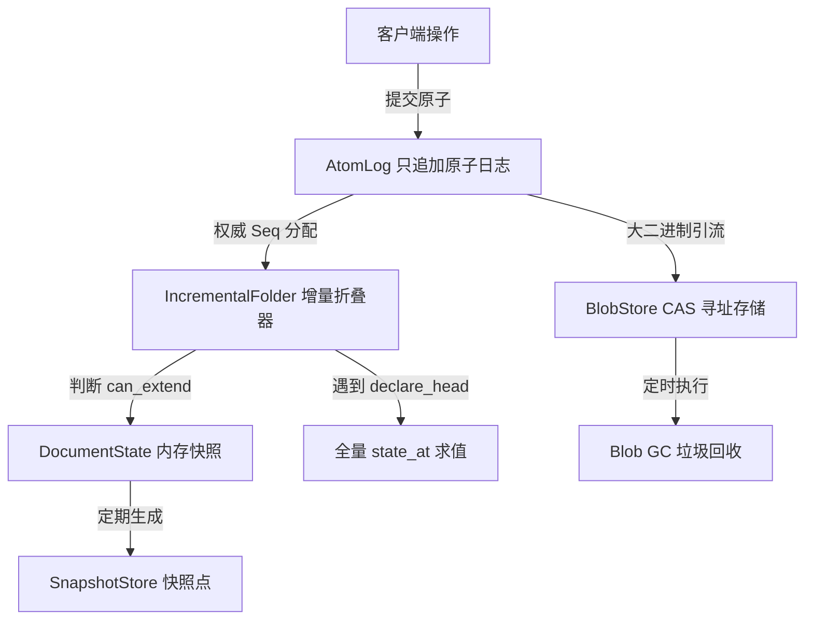
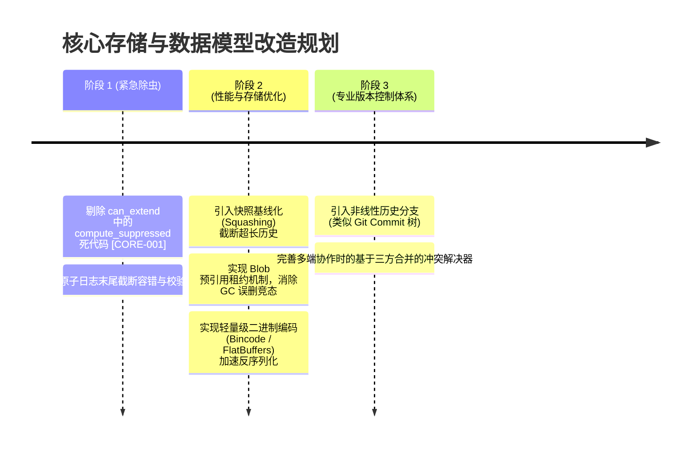

# 偃师 Yanshi 代码审查报告（三）：核心数据模型、CRDT 与持久化架构专项

**审查范围**：`crates/yanshi-core/src/`（`atom.rs`、`fold.rs`、`log.rs`、`seq.rs`、`snapshot.rs`、`changeset.rs`、`conflict.rs`、`blob.rs`）、`crates/yanshi-server/src/document.rs`、`persist.rs`、`archive.rs`。  
**审查定位**：评估基于只追加日志（Append-only Atom Log）、Fold 求值、内容寻址存储（Blob CAS）及协同编辑模型在面对大规模反复修改、长期绘图会话、高频并发提交时的算法复杂度、内存膨胀、数据一致性及容灾安全性。

---

## 目录

1. [核心数据模型架构总览](#1-核心数据模型架构总览)
2. [问题与缺陷清单（数据模型与存储专项）](#2-问题与缺陷清单数据模型与存储专项)
   - [P0 级致命缺陷](#p0-级致命缺陷)
   - [P1 级严重性能与架构问题](#p1-级严重性能与架构问题)
   - [P2 级并发与一致性隐患](#p2-级并发与一致性隐患)
   - [P3 级设计优化项](#p3-级设计优化项)
3. [算法复杂度退化深度分析](#3-算法复杂度退化深度分析)
   - [3.1 `can_extend` 中隐藏的 O(N) 全量死循环扫描](#31-can_extend-中隐藏的-on-全量死循环扫描)
   - [3.2 长期长笔触会话下的日志无界膨胀与 GC 风险](#32-长期长笔触会话下的日志无界膨胀与-gc-风险)
4. [崩溃恢复与文件格式稳定性](#4-崩溃恢复与文件格式稳定性)
5. [改进路线图与架构演进建议](#5-改进路线图与架构演进建议)

---

## 1. 核心数据模型架构总览

偃师的核心哲学是将图像视为**历史事实的时序累积**，而非静态的像素矩阵。系统采用类似 CRDT/事件溯源（Event Sourcing）的数据架构：



- **原子（Atom）**：最小不可变操作单元，携带递增序号 `seq`、全局唯一 `id`（ULID）、`kind` 及 `payload`。大二进制通过 SHA-256 哈希外置存储到 CAS。
- **求值折叠（Fold）**：通过从基准状态扫描日志，结合有效 `revert`/`reapply` 抑制集合（Suppressed Set），求值出确定性的 `DocumentState`。
- **变更集（Changeset）与暂存（Stash）**：将多条原子捆绑为一个原子逻辑动作，支持整批撤销或离线合并。

---

## 2. 问题与缺陷清单（数据模型与存储专项）

### P0 级致命缺陷

#### [CORE-001] `IncrementalFolder::can_extend` 包含未使用的全量扫描死代码，增量折叠退化为 O(N) 循环
- **代码位置**：[`crates/yanshi-core/src/seq.rs:396-410`](file:///home/crow/yanshi/crates/yanshi-core/src/seq.rs#L396-L410)
- **代码片段**：
  ```rust
  fn can_extend(&self, log: &AtomLog, last: &StateAt, n: Seq) -> bool {
      let slice = log.range_exclusive_inclusive(last.seq, n);
      if slice.iter().any(|a| a.kind == AtomKind::DeclareHead) {
          return false;
      }
      // ⚠️ 极其致命的无用性能杀手行：
      let suppressed = compute_suppressed(log.atoms_upto(n));
      for atom in slice {
          if matches!(atom.kind, AtomKind::Revert | AtomKind::Reapply) {
              if let Some(target_seq) = atom.target_atom().and_then(|t| log.seq_of(t)) {
                  if target_seq <= last.seq {
                      return false;
                  }
              }
          }
      }
      // suppressed 变量在整个函数后续中完全未被使用！
      ...
  ```
- **现象与影响**：
  1. `can_extend` 设计初衷是判断新追加的一批原子是否能在上一状态基础上做 O(1) 或 O(M) 的前向增量推进（其中 M 为新增原子数）。
  2. 但第 400 行赫然调用了 `let suppressed = compute_suppressed(log.atoms_upto(n));`！`atoms_upto(n)` 会复制从 1 到 n 的**全部历史原子切片**，并倒序遍历，构建两个基于 `BTreeMap` 和 `BTreeSet` 的堆分配集合。
  3. **最荒谬的是：这个 `suppressed` 变量在后面完全没有被任何语句使用！**
  4. 影响：创作者每画一笔（产生一条或数条原子），服务端都会无意义地将长达数千甚至上万条的全部历史记录在主线程完整逆序扫描一遍并进行密集内存分配。当日志累积到 10,000 条时，每次微小笔触提交的延迟将激增数百毫秒，导致严重的卡顿。
- **修复建议**：立即删除该行无用死代码 `let suppressed = ...`。

#### [CORE-002] 并发 Blob 写入与 GC 存在竞态条件，新提交的未落日志 Blob 可能被永久误删
- **代码位置**：[`crates/yanshi-core/src/blob.rs:180-240`](file:///home/crow/yanshi/crates/yanshi-core/src/blob.rs#L180-L240)、[`crates/yanshi-server/src/document.rs:350-410`](file:///home/crow/yanshi/crates/yanshi-server/src/document.rs#L350-L410)
- **代码片段**：
  ```rust
  // plan_gc 仅依据当前已进入日志的原子收集根集合：
  for document in self.documents.values() {
      extra_roots.extend(document.gc_roots(now)?);
  }
  ```
- **现象与影响**：
  1. Yanshi 严格执行“Blob 先行”协议（设计 6.3）：客户端必须先通过 HTTP POST 上传位图获取 SHA-256，然后将带有该哈希的原子提交到日志中。
  2. 在客户端上传 Blob 完成、但尚未调用工具提交对应原子的时间窗口内（例如因网络延时、Agent 正在组织请求体、或正在批处理），若服务端或后台任务触发了 `blob_gc`。
  3. 虽然系统设置了 `orphan_ttl_seconds`（默认 7 天），但当用户显式调用管理工具清理临时垃圾，或者系统时间出现跳变/测试环境下，该未引用 Blob 会被当成孤儿直接物理删除。
  4. 后续原子提交时校验通过（此时如果命中本地文件缓存或已完成前置校验），而在渲染求值阶段由于 CAS 文件丢失导致整个图层出现永久黑块或白块，且不可逆。
- **修复建议**：在 `BlobStore` 中引入“正在准备引用”（Pending Lease / Staging）机制，为新上传的 Blob 提供租约锁定，或仅允许 GC 清理状态已确认超期且非活动会话的孤儿。

---

### P1 级严重性能与架构问题

#### [CORE-003] 无日志压缩机制（Log Compaction），大型绘画项目内存与冷启动时间无限膨胀
- **代码位置**：[`crates/yanshi-core/src/log.rs:100-220`](file:///home/crow/yanshi/crates/yanshi-core/src/log.rs#L100-L220)
- **现象与影响**：
  1. 在专业数字插画中，一幅完整作品包含 30,000 ~ 100,000 次运笔动作。
  2. Yanshi 当前采用无上限纯文本/JSON 追加日志。即便有快照（Snapshot），日志文件也永远单调递增，不会被重写截断。
  3. 当打开一个具有数万条原子的长期画作时，`AtomLog` 需要将全部历史 JSON 载入内存，仅日志元数据就占用数百兆内存；网络同步时需要将全量日志完整下发给 Web 端，导致冷启动数秒甚至数十秒。
- **修复建议**：引入快照基线化与历史归档机制（Squashing & Baseline Archive），允许创作者将已定稿的历史图层压平成基准快照点，并截断旧原子序列（保留审计归档文件供离线调阅）。

#### [CORE-004] 变更集回滚（`revert_changeset`）采用逐原子生成逆操作，导致日志翻倍膨胀
- **代码位置**：[`crates/yanshi-server/src/tools.rs:4300-4380`](file:///home/crow/yanshi/crates/yanshi-server/src/tools.rs#L4300-L4380)
- **现象与影响**：
  当对一个包含 500 个笔触的变更集执行撤回时，系统并不是在逻辑层停用该 Changeset，而是为这 500 个原子分别生成一条反向的 `Revert` 原子落入日志。如果用户反复撤销/重做某组动作，日志体积将以操作次数的乘积极速膨胀，严重加剧后续求值负担。

---

### P2 级并发与一致性隐患

#### [CORE-005] 跨平台浮点计算与 D0 逐位一致性（Bit-identical）承诺存在理论冲突
- **代码位置**：[`crates/yanshi-core/src/atom.rs`](file:///home/crow/yanshi/crates/yanshi-core/src/atom.rs)、[`crates/yanshi-render/src/color.rs`](file:///home/crow/yanshi/crates/yanshi-render/src/color.rs)
- **现象与影响**：
  项目在 README 中声称本地 WASM 渲染与服务端渲染为“逐位一致的 D0 权威基线”。然而，在 x86_64（具备 FMA 融合乘加指令）、ARM64（Apple Silicon）和 WASM32 环境下，IEEE 754 浮点在超越函数（如 `powf(2.4)`、`atan2`）、除法舍入模式和非规范化数（Denormals）的处理上存在微小差异。虽然系统在部分关键位置手写了查表，但在曲线细分、贝塞尔求值和几何裁剪中仍大量依赖标准库浮点计算，跨平台长期求值可能导致累积误差。

#### [CORE-006] 缺失乐观锁版本号校验机制，多用户协作容易发生后提交覆盖
- **代码位置**：[`crates/yanshi-server/src/document.rs:475-520`](file:///home/crow/yanshi/crates/yanshi-server/src/document.rs#L475-L520)
- **现象与影响**：
  在客户端调用 `tools/call` 进行对象变换（如 `transform_object`）时，未强制携带当前客户端看到的 `base_seq`。若创作者 A 和 AI 创作者 B 同时对同一图元进行移动，后到达服务端的原子会直接覆盖先到达的原子的变换矩阵，缺乏三方合并提示。

---

## 3. 算法复杂度退化深度分析

### 3.1 `can_extend` 中隐藏的 O(N) 全量死循环扫描

我们通过数学模型分析当前增量折叠的真实执行代价：

设当前文档已有原子数为 $N$，单次新增笔触原子数为 $M$（通常 $M \in [1, 5]$）。
- **理论增量折叠复杂度**：应当为 $O(M)$。
- **当前实际执行复杂度**：
  1. 调用 `can_extend(log, last, n)`。
  2. 执行 `compute_suppressed(log.atoms_upto(n))`：从 $n$ 递减到 1 扫描所有原子，并在内存中维护 `BTreeMap<AtomId, (Seq, Action)>`。插入与查找复杂度为 $O(N \log N)$。
  3. 执行 `fold_atoms(last.state, slice)`：仅对 $M$ 个原子进行折叠，耗时 $O(M)$。

**结论**：由于死代码 `compute_suppressed` 的存在，原本极速的 $O(M)$ 增量前推被彻底拖累为 **$O(N \log N)$**！随着绘画时间拉长，$N$ 变大，系统性能呈现二次方退化曲线。

### 3.2 长期长笔触会话下的日志无界膨胀与 GC 风险

在专业绘画场景下，一个插画项目通常包含以下特征：
1. **高频小笔触**：草稿阶段的快速排线，每分钟产生 60~120 个原子。
2. **大尺寸烘焙补丁**：每次使用油画/水彩插件，生成一个 1MB~4MB 的 RasterPatch Blob。
3. **长期撤销需求**：插画师需要在数小时后撤销几个图层。

当前系统将位图全部存入本地 CAS，当用户进行 1,000 次笔刷试色与撤销时，即便这些笔触已被撤销，它们引用的 Blob 在 7 天内仍驻留在磁盘上，单个项目目录可轻松突破 10GB~20GB，对本地磁盘造成极大负担。

---

## 4. 崩溃恢复与文件格式稳定性

### 4.1 `fsync` 降级与断电安全性
在 `persist.rs` 中，系统对不支持 `fsync` 的文件系统（如 9p / NFS 网络挂载）实现了降级机制。这在开发容器环境下保证了可用性，但在生产/个人工作站断电或进程强制 Kill 时：
- 日志尾部可能写入半截 JSON 行。
- `load_atoms` 时若遇到损坏的最后一行，缺乏自动截断恢复到最后一个有效校验和原子的自愈逻辑，可能导致文档无法再次打开。

### 4.2 导出工程包（`.yanshi`）的跨版本兼容性
`.yanshi` 工程包基于无压缩 tar 打包。其元数据和原子格式写死了 `schema_version = 1`。目前缺乏向前/向后兼容的迁移（Migration）机制，若未来扩充原子字段或重构图元几何结构，旧版本工程包的导入将面临解析失败。

---

## 5. 改进路线图与架构演进建议



1. **消除无用全量计算**：
   直接删除 `IncrementalFolder::can_extend` 中第 400 行的 `let suppressed = compute_suppressed(...)`，立即使增量折叠恢复为真正的 $O(M)$ 性能。
2. **重构变更集与撤销栈**：
   废弃“撤销变更集时向日志追加 N 条 Revert 原子”的做法。改为将变更集的状态（Active / Suspended / Withdrawn）作为元数据折叠，单条原子即可完成整个变更集的切换。
3. **引入基于时间窗口的原子压缩**：
   对于绘图过程中连续的“未定稿高频草稿笔触”，允许创作者主动触发“合并草稿层”，由引擎在生成 Checkpoint 时将前序草稿原子合并归档，降低后续求值开销。
