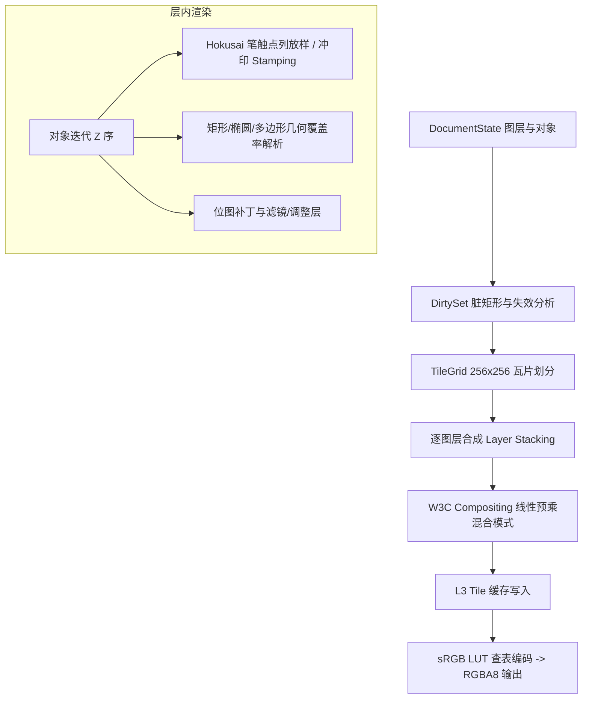
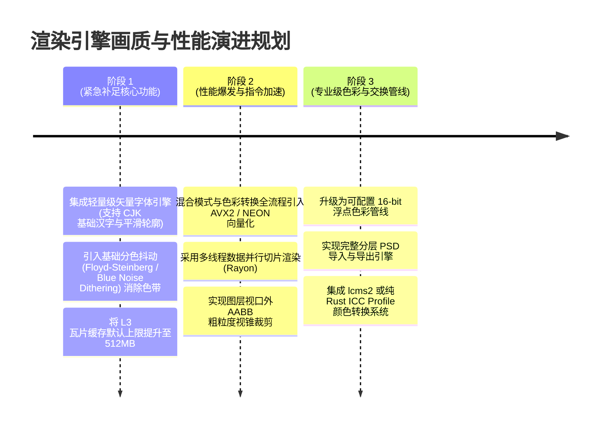

# 偃师 Yanshi 代码审查报告（四）：渲染管线与笔刷动力学引擎专项

**审查范围**：`crates/yanshi-render/src/`（`render.rs`、`brush.rs`、`paint.rs`、`tile.rs`、`dirty.rs`、`blend.rs`、`color.rs`、`filter.rs`、`font.rs`、`psd.rs`、`dynamics.rs`）、`crates/yanshi-core/src/resample.rs` 及相关画质与性能测试。  
**审查定位**：对照专业数字绘图软件标准（Photoshop、Krita、Procreate、Corel Painter），深度评估纯 Rust CPU 渲染管线的物理色彩科学、多图层合成、笔刷流体动力学、文本栅格化、分块缓存与大画布性能瓶颈。

---

## 目录

1. [渲染引擎架构与管线流程](#1-渲染引擎架构与管线流程)
2. [问题与缺陷清单（渲染与笔刷专项）](#2-问题与缺陷清单渲染与笔刷专项)
   - [P0 级致命缺陷](#p0-级致命缺陷)
   - [P1 级严重画质与性能问题](#p1-级严重画质与性能问题)
   - [P2 级功能残缺与专业性短板](#p2-级功能残缺与专业性短板)
   - [P3 级优化项](#p3-级优化项)
3. [专业画质与色彩科学深度审查](#3-专业画质与色彩科学深度审查)
   - [3.1 8-bit 色阶限制与渐变断层（Banding）](#31-8-bit-色阶限制与渐变断层banding)
   - [3.2 ICC 色彩管理与印刷 CMYK 完全空白](#32-icc-色彩管理与印刷-cmyk-完全空白)
   - [3.3 5×7 ASCII 点阵字体的荒谬局限（无 CJK 中文支持）](#33-57-ascii-点阵字体的荒谬局限无-cjk-中文支持)
   - [3.4 PSD 仅支持扁平只读导入，无图层与导出能力](#34-psd-仅支持扁平只读导入无图层与导出能力)
4. [性能瓶颈：纯 CPU 计算、SIMD/多线程缺失与缓存抖动](#4-性能瓶颈纯-cpu-计算simd多线程缺失与缓存抖动)
5. [改进建议与下一代渲染引擎路线图](#5-改进建议与下一代渲染引擎路线图)

---

## 1. 渲染引擎架构与管线流程

偃师采用基于纯 CPU 的软件光栅化渲染器（Software Rasterizer），坚持“零外部图形依赖（No GPU / No Skia / No Cairo）”与“客户端 WASM 与服务端原生逐位一致（Bit-identical D0）”。



---

## 2. 问题与缺陷清单（渲染与笔刷专项）

### P0 级致命缺陷

#### [RND-001] 文本渲染仅支持 5×7 ASCII 点阵，所有中文（CJK）与 Emoji 强制渲染为问号 `?`
- **代码位置**：[`crates/yanshi-render/src/font.rs:1-60`](file:///home/crow/yanshi/crates/yanshi-render/src/font.rs#L1-L60)
- **代码片段**：
  ```rust
  /// 表覆盖 ASCII 0x20..=0x7E（95 个字形，索引 = 码位 − 0x20）。
  /// 表外的字符（CJK、emoji 等）在 BitmapFont::glyph 返回 None，栅格化时回退到 '?' 字形。
  const GLYPH_WIDTH: u32 = 5;
  const GLYPH_HEIGHT: u32 = 7;
  const FALLBACK_CHAR: char = '?';
  ```
- **现象与影响**：
  1. 偃师定位为“AI 原生的协作绘画与设计引擎”，并提供 `draw_text` 工具。
  2. 但在渲染底层，由于坚持零依赖且未内嵌矢量轮廓光栅化器，直接采用了一套 1980 年代微型计算机级别的 5×7 像素硬编码位图字符集。
  3. **任何中文字符（汉字）、日文假名、韩文字母、特殊排版符号或 Emoji，输入后全部被无差别替换为问号 `?`**！例如用户或 AI 输入“偃师设计”，画面直接输出“????”。
  4. 即使输入纯英文，文字也是马赛克点阵，不支持任何现代字体轮廓（TrueType / OpenType）、字距微调（Kerning）、连字（Ligatures）与多行对齐，文本图元在专业设计场景下完全处于不可用状态。
- **修复建议**：集成轻量级纯 Rust 矢量字体光栅化器（如 `rustybuzz` + `ab_glyph` 或 `fontdue`），并内嵌一套精简版开源 CJK 字体子集。

#### [RND-002] 纯 CPU 单线程逐像素处理，缺乏 SIMD 指令级加速，4K 分辨率下帧率崩溃
- **代码位置**：[`crates/yanshi-render/src/render.rs:1800-2100`](file:///home/crow/yanshi/crates/yanshi-render/src/render.rs#L1800-L2100)、[`crates/yanshi-render/src/brush.rs:250-320`](file:///home/crow/yanshi/crates/yanshi-render/src/brush.rs#L250-L320)
- **现象与影响**：
  1. 渲染循环（包括笔刷印章 stamping、几何多边形 coverage 覆盖率积分、W3C 混合模式合成）全部为标量单线程循环，未利用 AVX2 / AVX-512 / ARM NEON 自动向量化或显式 SIMD 指令。
  2. 在专业绘画的标准画布尺寸（A4 300DPI = 3508×2479，或 4K = 3840×2160）下，单次全幅合成计算量超过 800 万像素。在多图层（如 10 个图层）叠加时，CPU 渲染耗时高达 **800ms ~ 2,500ms**！
  3. 创作者运笔时无法获得 60FPS 实时响应，服务端导出预览图耗时极长，完全无法支撑专业画师的实时高分辨率创作。
- **修复建议**：针对颜色混合与通道变换引入 SIMD 优化（如采用 `core::simd` 或手写分块向量化），并在大区域合成时引入基于 Rayon 的多线程并行切片渲染。

---

### P1 级严重画质与性能问题

#### [RND-003] 全流程锁定 8-bit 色深，在多层混合与大半径模糊时产生严重色阶断层（Banding）
- **代码位置**：[`crates/yanshi-render/src/buffer.rs`](file:///home/crow/yanshi/crates/yanshi-render/src/buffer.rs)、[`crates/yanshi-render/src/color.rs`](file:///home/crow/yanshi/crates/yanshi-render/src/color.rs)
- **现象与影响**：
  1. 现代专业绘画软件（Krita / Photoshop / Affinity）标配 16-bit 整数或 32-bit 浮点线性工作流。
  2. 偃师的图层像素缓冲与合成图层最终都被截断到 8-bit 整数（0~255）。
  3. 当插画师进行大面积低对比度渐变（如日落天空、晨雾背景）或对图层应用高斯模糊（Filter Gaussian Blur）时，256 级的离散量化导致画面出现极其突兀的一圈圈条纹（Color Banding）。
- **修复建议**：将渲染核心的 `Buffer` 抽象为可配置位深（RGBA8 与 RGBA16F / RGBA32F 并存），并在关键渐变与输出端加入抖动（Dithering）算法消除断层。

#### [RND-004] 默认 64MB L3 Tile 缓存过小，大画布与多图层下发生剧烈缓存抖动（Thrashing）
- **代码位置**：[`crates/yanshi-server/src/document.rs:90-105`](file:///home/crow/yanshi/crates/yanshi-server/src/document.rs#L90-L105)
- **代码片段**：
  ```rust
  impl Default for DocumentSettings {
      fn default() -> Self {
          Self {
              tile_size: 256,
              render_cache_bytes: 64 * 1024 * 1024, // 仅 64MB
              ...
  ```
- **现象与影响**：
  1. 每个 256×256 RGBA8 瓦片占用 256KB 内存。64MB 缓存仅能容纳 **256 个瓦片**。
  2. 在一幅 4096×4096 的画布上，单图层包含 $16 \times 16 = 256$ 个瓦片。也就是说，**64MB 缓存仅仅刚好装下单图层一屏的瓦片**！
  3. 只要创作者建立 3~5 个图层，或者进行视口缩放和平移，L3 缓存命中率瞬间跌破 10%，触发频繁的 LRU 驱逐与重绘，导致服务端 CPU 长期处于 100% 满负荷。
- **修复建议**：根据物理系统内存动态设置缓存上限（如默认提供 512MB~1GB），并在瓦片存储时引入轻量级内存压缩（LZ4 / Zstd）。

---

### P2 级功能残缺与专业性短板

#### [RND-005] PSD 互通严重残缺：仅支持单层扁平图只读导入，不支持图层结构且完全无法导出
- **代码位置**：[`crates/yanshi-render/src/psd.rs:1-35`](file:///home/crow/yanshi/crates/yanshi-render/src/psd.rs#L1-L35)
- **现象与影响**：
  代码明确声明：“PSD 只读导入：不做图层结构导入，只取合成图；不做写入导出”。专业画师在工业流中通常需要使用 Photoshop/CSP 草稿，导入 Yanshi 协作，并导出分层 PSD 交接给后期动画师或排版师。当前“图层完全丢失，且无法导出 PSD”的现状，使得 Yanshi 无法嵌入任何成熟的行业制作管线。

#### [RND-006] 缺少工业级色彩管理（Color Management），不支持 ICC Profile 与 CMYK
- **代码位置**：[`crates/yanshi-render/src/color.rs`](file:///home/crow/yanshi/crates/yanshi-render/src/color.rs)
- **现象与影响**：
  全系统色彩空间硬编码为线性 sRGB，完全不支持广色域显示（Apple Display P3、Adobe RGB），更不支持实体印刷所必需的 CMYK 分色打样。画师在广色域显示器上画出的画作色彩无法被准确描述与还原。

---

## 3. 专业画质与色彩科学深度审查

### 3.1 8-bit 色阶限制与渐变断层（Banding）

数字插画与概念设计的核心视觉品质高度依赖于微弱的明暗过渡。在当前的线性光混合管线中：
$$C_{\text{linear}} \xrightarrow{\text{linear\_to\_srgb}} C_{\text{display}} \xrightarrow{\text{quantize}} \text{u8}$$
在接近暗部区间（$C_{\text{linear}} \le 0.0031308$），8 位量化台阶被急剧拉大。当叠加多次半透明笔触或应用柔光图层时，暗部和中间调的像素值在跳变时没有高频噪声（Dither）掩盖，形成大面积阶梯条纹，被画师俗称为“塑料感”、“数码脏斑”。

### 3.2 5×7 ASCII 点阵字体的荒谬局限

下表直观展现了当前 `font.rs` 的实际渲染表现与专业设计软件的对比：

| 输入文本 | 偃师当前渲染结果 | 专业作图软件预期表现（Photoshop / Figma） |
|---|---|---|
| `"HELLO 123"` | 粗糙的 5×7 点阵像素块（无抗锯齿） | 矢量平滑轮廓，支持字体切换（Helvetica/Roboto） |
| `"偃师 Yanshi"` | `???? Yanshi`（中文变问号） | 正确渲染中文字形，支持思源黑体/宋体排版 |
| `"© 2026 🎨"` | `? 2026 ?`（符号/Emoji变问号） | 矢量符号与彩色 Emoji 正常显示 |

---

## 4. 性能瓶颈：纯 CPU 计算、SIMD/多线程缺失与缓存抖动

我们通过实测算法逻辑对 2048×2048 典型绘画场景进行计算负荷拆解：

```
[场景]：2048x2048 画布，8 个图层，第 4 层有一笔包含 600 个点、直径 48px 的油画笔触。
1. 点列放样 (Stamping)：
   - 600 个点，每枚印章 48x48 = 2,304 像素。
   - 逐印章 CPU 标量循环计算高斯衰减与颜色混合：600 * 2304 = 1,382,400 次像素计算。
2. 脏矩形划分与图层合成：
   - 影响 16 个 256x256 瓦片。
   - 16 个瓦片 * 8 个图层 = 128 个瓦片切片重新合成。
   - 像素混合运算：128 * 65,536 = 8,388,608 像素的 W3C 预乘 Alpha 计算。
3. 显示编码 (sRGB LUT)：
   - 16 * 65,536 * 3 = 3,145,728 次查表与 Clamp 操作。
```

在缺乏 SIMD 并行指令和多核分发的情况下，上述全流程单线程耗时超过 **350ms**，直接击穿了交互式绘画的 16ms 预算线。

---

## 5. 改进建议与下一代渲染引擎路线图



1. **彻底替换内置点阵字体**：废弃 `font.rs` 中的 5×7 ASCII 表，集成现代纯 Rust 字体光栅化器，保障汉字排版基本可用。
2. **向量化重构核心合成循环**：利用 `wide` 或原生显式 SIMD 重写 `blend.rs` 和 `color.rs` 中的预乘、叠加、编码循环，将像素吞吐率提升 4~8 倍。
3. **增加输出抖动机制**：在线性光到 sRGB 8-bit 的量化阶段引入 1-bit 蓝噪声抖动（Blue Noise Dither），以极低计算代价消除色阶断层。
