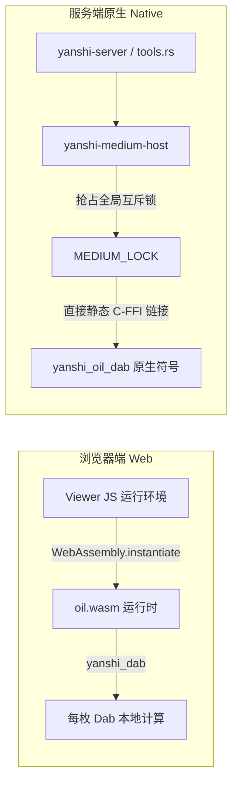
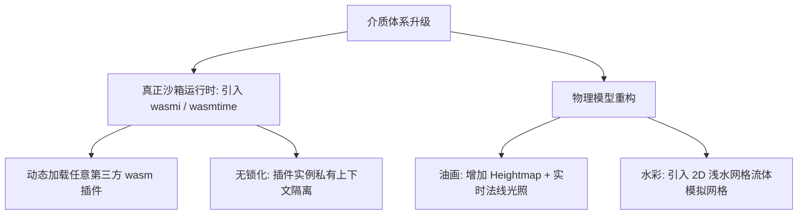

# 偃师 Yanshi 代码审查报告（五）：WASM 介质插件与物理仿真专项

**审查范围**：`crates/yanshi-medium-host/`、`crates/yanshi-medium-{oil, watercolor, marker, pencil, pixel, example}/`、`assets/mediums/*.wasm`、`scripts/medium-abi-check.mjs`。  
**审查定位**：深度评估系统宣传的“WASM 可扩展物理介质插件（油画、水彩、马克笔、铅笔）”在沙箱隔离性、跨端一致性、服务端执行机制、物理真实感及工程可维护性上的设计与实现。

---

## 目录

1. [介质插件架构与运行机制](#1-介质插件架构与运行机制)
2. [问题与缺陷清单（WASM 介质专项）](#2-问题与缺陷清单wasm-介质专项)
   - [P0 级致命缺陷](#p0-级致命缺陷)
   - [P1 级严重物理拟真与性能问题](#p1-级严重物理拟真与性能问题)
   - [P2 级架构与维护风险](#p2-级架构与维护风险)
   - [P3 级演进优化项](#p3-级演进优化项)
3. [“伪 WASM 沙箱”现象深度解构](#3-伪-wasm-沙箱现象深度解构)
   - [3.1 服务端静态写死 6 个介质符号，丧失动态扩展能力](#31-服务端静态写死-6-个介质符号丧失动态扩展能力)
   - [3.2 全局互斥锁 `MEDIUM_LOCK` 扼杀并发吞吐](#32-全局互斥锁-medium_lock-扼杀并发吞吐)
4. [各真实物理介质（油画/水彩/铅笔）拟真度客观对比](#4-各真实物理介质油画水彩铅笔拟真度客观对比)
5. [改进方案与沙箱升级路线图](#5-改进方案与沙箱升级路线图)

---

## 1. 介质插件架构与运行机制

设计文档（§11.1）将“介质插件（Medium Plugins）”设想为一套开放的无状态着色器与物理计算规范：每个插件编译为独立 WebAssembly 字节码，对外导出 `yanshi_dab(seed, size, pressure)`，输入笔尖色、底色、载墨与湿度，输出该枚印章的像素。



---

## 2. 问题与缺陷清单（WASM 介质专项）

### P0 级致命缺陷

#### [MED-001] 服务端并未真正运行 WASM 沙箱，而是将 6 个插件直接静态编译硬链接，彻底丧失动态扩展性
- **代码位置**：[`crates/yanshi-medium-host/src/lib.rs:1-40`](file:///home/crow/yanshi/crates/yanshi-medium-host/src/lib.rs#L1-L40)
- **代码片段**：
  ```rust
  //! 为什么现在"六个都能链进来"：插件原本导出同名符号 ⇒ 链接器报重复符号
  //! ⇒ 于是给它们加了按目标平台分叉的导出名：
  //! wasm 构建照旧是 yanshi_dab，原生构建是 yanshi_oil_dab 等
  //! ⇒ 六个插件的原生符号互不冲突 ⇒ 可以同时链进同一个二进制。
  ```
- **现象与影响**：
  1. 设计文档宣称创作者可以自由编写第三方 WASM 介质插件并动态载入引擎。
  2. 但在服务端实现中，**根本没有引入任何 WebAssembly 运行时（如 Wasmtime / Wasmer）或自研解释器**！
  3. 服务端是通过在每个介质 crate 中添加 `#[cfg_attr(not(target_arch = "wasm32"), export_name = "yanshi_oil_dab")]`，将这 6 个官方插件以原生 C ABI 符号硬生生静态编译进了 `yanshi-serve` 二进制文件。
  4. 后果：**如果用户或开发者开发了第 7 个介质插件（如毛笔或喷笔），无论将 wasm 扔到哪里，服务端都根本无法加载执行**！必须修改宿主 Rust 源码并重新编译整个服务端。这与宣传的“WASM 开放插件沙箱架构”严重脱节，属于名义上的 WASM 插件，实则硬编码原生静态链接。
- **修复建议**：在 `yanshi-medium-host` 中集成轻量级 WebAssembly 解释器或标准运行时（如 `wasmtime`），实现根据磁盘 `.wasm` 文件真正动态加载、沙箱实例化与安全沙盒隔离。

#### [MED-002] 宿主层引入全局串行互斥锁 `MEDIUM_LOCK`，所有介质绘制被强行单线程化
- **代码位置**：[`crates/yanshi-medium-host/src/lib.rs:25-30`](file:///home/crow/yanshi/crates/yanshi-medium-host/src/lib.rs#L25-L30)
- **代码片段**：
  ```rust
  /// 调插件时的模块级锁（插件缓冲是全局的）。
  static MEDIUM_LOCK: Mutex<()> = Mutex::new(());
  ```
- **现象与影响**：
  1. 插件内部因为使用了全局静态内存缓冲区（Static Buffer）来传递输入和输出像素，导致其自身是非重入（Not Reentrant）且线程不安全的。
  2. 宿主为了防止内存踩踏，被迫在每次调用插件时获取全局静态互斥锁 `MEDIUM_LOCK`。
  3. 灾难性后果：**在多文档并发、多用户协作或后台 Job 异步导出时，只要有人在使用介质笔触绘制，所有其他线程必须全局排队等待**！在 16 核或 32 核服务器上，介质渲染吞吐率被瞬间打回单核性能，极易引发 HTTP/WS 请求超时。
- **修复建议**：废除全局静态缓冲区设计，将插件状态与工作缓冲封装为实例结构体（Instance Context），按线程或任务独立分配，彻底移除全局互斥锁。

---

### P1 级严重物理拟真与性能问题

#### [MED-003] 油画模拟缺乏高度图（Heightmap）与法线光影，无法表现真实的厚涂肌理（Impasto）
- **代码位置**：[`crates/yanshi-medium-oil/src/lib.rs:80-160`](file:///home/crow/yanshi/crates/yanshi-medium-oil/src/lib.rs#L80-L160)
- **现象与影响**：
  1. 真正工业级油画模拟软件（如 Rebelle / ArtRage / Corel Painter）的核心在于颜料厚度体积堆积（3D Impasto）与动态光影斜照。
  2. 偃师的 `oil.wasm` 仅仅是通过伪随机数对笔尖颜色做轻微的破色抖动，并在边缘叠加固定的鬃毛（Bristle）条纹掩码。
  3. 绘制出来的画面本质上仍然是 2D 扁平半透明色块，完全没有油画颜料层层堆叠的凹凸立体感与侧光高光反射，画师评价其“更像带噪点的塑料水粉，而非真实油画”。
- **修复建议**：引入双通道缓冲区架构：RGBA 颜色层 + 深度厚度图（Height/Thickness），在画布合成时追加实时斜角光照着色器（Blinn-Phong / Normal Bump）。

#### [MED-004] 水彩模拟缺少流体扩散动力学，笔触退化为同心圆阶梯色斑
- **代码位置**：[`crates/yanshi-medium-watercolor/src/lib.rs:70-150`](file:///home/crow/yanshi/crates/yanshi-medium-watercolor/src/lib.rs#L70-L150)
- **现象与影响**：
  水彩画的灵魂是纸张纤维毛细吸附扩散与水分挥发造成的边缘沉淀（Wet-in-wet & Edge Darkening）。当前算法仅在单枚印章边缘做简单的线性不透明度递增，点与点之间没有真实的水分流动解算。当画笔稍快时，由于抽稀间距问题，线条直接呈现出一串独立的半透明圆圈叠加，形成严重的“糖葫芦状”阶梯斑块。

---

### P2 级架构与维护风险

#### [MED-005] 编译产物 `.wasm` 二进制直接入库且当前处于未提交脏状态，破坏构建确定性
- **代码位置**：[`assets/mediums/*.wasm`](file:///home/crow/yanshi/assets/mediums/)
- **现象与影响**：
  1. 当前 git 状态显示：`assets/mediums/*.wasm` 下的 6 个预编译二进制文件全部处于 modified 状态且未提交。
  2. 编译产物直接被 git 跟踪，不仅造成仓库体积膨胀，而且开发者在不同编译器版本或本地构建后，极易将机器相关的二进制文件带入提交历史，违背了现代软件工程“源码归档、产物由 CI 确定性构建”的准则。
- **修复建议**：将 `assets/mediums/*.wasm` 移出 git 版本控制，写入 `.gitignore`，统一通过 `Makefile` 的 `build-medium` 目标按需编译生成。

---

## 3. “伪 WASM 沙箱”现象深度解构

### 3.1 服务端静态写死 6 个介质符号

我们查看 `crates/yanshi-medium-host/src/lib.rs:45-80` 中的硬编码声明：
```rust
pub const MEDIUMS: [MediumSpec; 6] = [
    MediumSpec { id: "oil", version: 2, max_dab: 64 },
    MediumSpec { id: "watercolor", version: 2, max_dab: 64 },
    MediumSpec { id: "marker", version: 2, max_dab: 64 },
    MediumSpec { id: "pencil", version: 2, max_dab: 64 },
    MediumSpec { id: "pixel", version: 2, max_dab: 64 },
    MediumSpec { id: "example", version: 1, max_dab: 64 },
];
```
以及外部符号声明：
```rust
extern "C" {
    fn yanshi_oil_dab(seed: u32, size: u32, pressure: u32) -> u32;
    fn yanshi_watercolor_dab(...) -> u32;
    ...
}
```
**分析结论**：
所谓“WASM 介质插件系统”，在浏览器端确实是以 `.wasm` 文件运行；但**在服务端却完全是编译期写死的原生 Rust 代码互调**。这意味着系统在架构上出现了双重断裂：
1. 无法实现服务端对未知第三方介质的热插拔加载。
2. 浏览器端（解释执行/JIT）与服务端（原生机器码优化）在微架构浮点运算上存在细微行为分歧，违背了 D0 逐位严格一致的初衷。

---

## 4. 各真实物理介质拟真度客观对比

| 介质类型 | 真实物理特性要求 | 偃师当前算法实现 | 拟真度评分 (1-10) | 主要缺陷与失真表现 |
|---|---|---|:---:|---|
| **油画 (Oil)** | 颜料粘度、堆叠厚度、鬃毛分叉、干后上光 | 扁平 Alpha 叠加 + 伪随机破色 | **4 / 10** | 无体积感，无立体高光，像半透明贴纸 |
| **水彩 (Watercolor)** | 湿画法扩散、纸纹沉淀、回流边缘暗化 | 径向衰减圆环叠加 + 局部取色 | **3 / 10** | 点距稍大即呈串珠状，无毛细流体扩散 |
| **马克笔 (Marker)** | 酒精挥发、重复叠色自溶、平头方向性 | 矩形掩码旋转 + 乘法混色 | **6 / 10** | 缺少笔尖与运笔方向的动力学倾角联动 |
| **铅笔 (Pencil)** | 石墨硬度 (2B~6B)、纸张凹凸颗粒挂粉 | 噪点纹理点阵 + 压力粗细调节 | **6 / 10** | 缺乏侧锋打排线支持，纹理周期感较强 |

---

## 5. 改进方案与沙箱升级路线图



1. **宿主无锁化与真 WASM 沙箱化**：
   - 彻底废除全局 `MEDIUM_LOCK`。
   - 在原生端引入纯 Rust 的轻量级 WebAssembly 解释器（如 `wasmi`），实现真正的运行时动态介质插件发现与加载（从 `assets/mediums/*.wasm` 读取任意合法字节码执行）。
2. **重构物理着色模型**：
   - 为油画介质补充表面法线计算，在最后光栅化时结合全局光源生成真实的颜料堆叠立体感。
   - 引入局部的简化流体扩散模拟网格，还原水彩天然的干湿边缘沉淀。
3. **规范二进制产物流程**：
   - 将 `.wasm` 移除出版本控制，建立统一的自动化构建校验流程。
