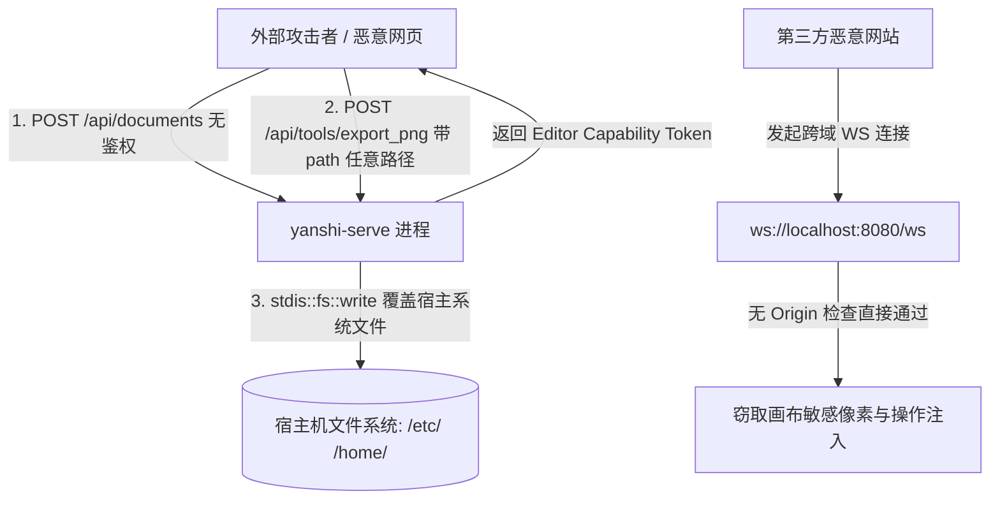
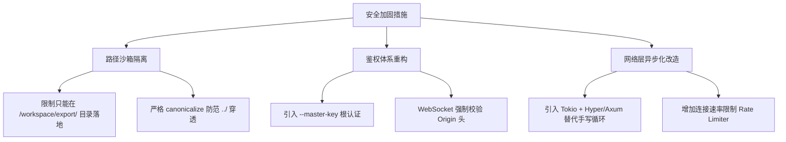

# 偃师 Yanshi 代码审查报告（六）：网络服务、网络安全与运维架构专项

**审查范围**：`crates/yanshi-http/src/`（`server.rs`、`http.rs`、`ws.rs`、`sha1.rs`）、`crates/yanshi-server/src/token.rs`、`crates/yanshi-server/src/tools.rs` 中文件操作工具、`deploy/`、`scripts/package-release.sh`。  
**审查定位**：深度评估零依赖手写 HTTP/WebSocket 协议栈在生产环境下的边界安全、文件系统隔离、越权风险、连接耗尽 DoS、跨站劫持以及自动化运维可靠性。

---

## 目录

1. [威胁模型与网络拓扑](#1-威胁模型与网络拓扑)
2. [安全与运维漏洞清单](#2-安全与运维漏洞清单)
   - [P0 级致命安全漏洞](#p0-级致命安全漏洞)
   - [P1 级严重安全隐患](#p1-级严重安全隐患)
   - [P2 级架构与服务鲁棒性缺陷](#p2-级架构与服务鲁棒性缺陷)
   - [P3 级运维与监控优化项](#p3-级运维与监控优化项)
3. [核心漏洞机理深度剖析](#3-核心漏洞机理深度剖析)
   - [3.1 任意文件写入/覆盖漏洞（CVE 级严重性）](#31-任意文件写入覆盖漏洞cve-级严重性)
   - [3.2 无鉴权签发可写 Token 形成的越权组合拳](#32-无鉴权签发可写-token-形成的越权组合拳)
   - [3.3 缺失 Origin 检查的跨站 WebSocket 劫持 (CSWSH)](#33-缺失-origin-检查的跨站-websocket-劫持-cswsh)
4. [每连接一线程模型的 DoS 脆弱性分析](#4-每连接一线程模型的-dos-脆弱性分析)
5. [系统安全加固与生产运维演进方案](#5-系统安全加固与生产运维演进方案)

---

## 1. 威胁模型与网络拓扑

偃师被设计为可由本地 Agent（MCP stdio）和远程 Web/AI 用户（HTTP/WebSocket）共同接入的协作绘画引擎。在暴露网络端口（`--bind 0.0.0.0:8080`）的场景下，其威胁模型如下：



---

## 2. 安全与运维漏洞清单

### P0 级致命安全漏洞

#### [SEC-001] `export_png` 与 `export_project` 存在未受限的任意文件写入与覆盖漏洞（Arbitrary File Overwrite）
- **代码位置**：[`crates/yanshi-server/src/tools.rs:11409`](file:///home/crow/yanshi/crates/yanshi-server/src/tools.rs#L11409)、[`tools.rs:11265`](file:///home/crow/yanshi/crates/yanshi-server/src/tools.rs#L11265)
- **代码片段**：
  ```rust
  // export_png 中：
  std::fs::write(&path, &png).map_err(|error| {
      YanshiError::new(
          ErrorCode::InvalidArgument,
          ErrorContext::detail(format!("写文件失败：{path} ⇒ {error}")),
      )
  })?;

  // export_project 中：
  std::fs::write(&path, &tar).map_err(...)?;
  ```
- **现象与影响**：
  1. 工具层 `export_png` 和 `export_project` 直接接收客户端传入的 `path` 字符串参数，**未对路径做任何沙箱白名单限制、未对路径做规范化（Canonicalize）校验，亦未限制在工作区根目录之内**。
  2. 任何拥有 Editor 权限的客户端（见 SEC-002，任何人都可以轻松拿到该权限），均可传入 `{"path": "/etc/hosts"}`、`{"path": "/home/user/.ssh/authorized_keys"}` 或服务启动脚本路径。
  3. 服务端进程将以其自身的 OS 运行权限，直接将 PNG 图片或 Tar 归档覆盖写入目标文件！这构成了极其危险的**任意文件写入/破坏/提权漏洞**，可直接摧毁宿主机系统或导致远程代码执行（RCE）。
- **修复建议**：
  - 严禁允许客户端指定绝对系统路径。
  - 强制规定所有导出路径必须落在服务启动时指定的 `--export-dir` 内部，并通过 `path.canonicalize()` 严格防范 `../` 目录穿越。

#### [SEC-002] `import_project` 与 `import_asset` 存在任意文件读取漏洞（Arbitrary File Read）
- **代码位置**：[`crates/yanshi-server/src/tools.rs:9520`](file:///home/crow/yanshi/crates/yanshi-server/src/tools.rs#L9520)、[`tools.rs:11134`](file:///home/crow/yanshi/crates/yanshi-server/src/tools.rs#L11134)
- **代码片段**：
  ```rust
  let bytes = std::fs::read(&path).map_err(|error| {
      YanshiError::new(
          ErrorCode::ReferenceNotFound,
          ErrorContext::detail(format!("读不到工程包 {path}：{error}")),
      )
  })?;
  ```
- **现象与影响**：
  客户端传入的 `path` 直接被传递给 `std::fs::read(&path)` 读取。攻击者可通过传入 `/etc/shadow` 或私钥文件，利用报错反馈信息进行文件探测或直接窃取宿主机敏感文件。
- **修复建议**：导入必须限定在受信任上传目录，禁止从宿主任意路径直接读取。

#### [SEC-003] `/api/documents` 完全开放无鉴权，任何人均可直接签发高权限 Editor Token
- **代码位置**：[`crates/yanshi-http/src/server.rs:650-710`](file:///home/crow/yanshi/crates/yanshi-http/src/server.rs#L650-L710)
- **现象与影响**：
  1. 服务端未设置 Master API Key、管理员密码或任何前置身份验证。
  2. 任何人只要向 `POST /api/documents` 发送空请求或新文档名称，服务端立即无条件为其生成一个随机的 Capability Token，且默认角色为 **`Role::Editor`**！
  3. 拿到该 Token 后，攻击者即可畅通无阻地调用全部 114 个工具，结合 [SEC-001]，形成一条无阻碍攻陷服务器的完整利用链（Exp Chain）。
- **修复建议**：引入服务端全局访问控制密钥（`--api-key` 或 HTTP Bearer Token），仅在通过主鉴权后才允许开立文档与分配 Capability Token。

---

### P1 级严重安全隐患

#### [SEC-004] WebSocket 握手未校验 `Origin` 请求头，存在跨站 WebSocket 劫持漏洞 (CSWSH)
- **代码位置**：[`crates/yanshi-http/src/server.rs:1050-1100`](file:///home/crow/yanshi/crates/yanshi-http/src/server.rs#L1050-L1100)、[`crates/yanshi-http/src/ws.rs:50-90`](file:///home/crow/yanshi/crates/yanshi-http/src/ws.rs#L50-L90)
- **代码片段**：
  全局搜索 `Origin` 请求头处理，匹配数为 0。
- **现象与影响**：
  1. 浏览器发起 WebSocket 握手时不受同源策略（SOP）限制，服务器必须显式比对 `Origin` 字段。
  2. Yanshi 在处理 `/ws` 握手时完全忽略了 `Origin`。
  3. 当用户在本地启动 `yanshi-serve` 绘图，同时在浏览器中浏览其他恶意网页时，恶意网页脚本可以静默向 `ws://127.0.0.1:8080/ws?doc=...` 发起连接，直接读取用户当前正在绘制的画面机密，或注入恶意原子篡改画作。
- **修复建议**：在握手阶段强制校验 `Origin` 是否与当前服务端监听的 Host 一致，或检查允许的域名白名单。

#### [SEC-005] 缺乏慢速攻击（Slowloris）防护，64 个连接耗尽即导致全服拒绝服务 (DoS)
- **代码位置**：[`crates/yanshi-http/src/server.rs:400-480`](file:///home/crow/yanshi/crates/yanshi-http/src/server.rs#L400-L480)
- **代码片段**：
  ```rust
  let listener = TcpListener::bind(&options.bind)?;
  for stream in listener.incoming() {
      if active_connections.load(Ordering::Relaxed) >= options.max_connections {
          // 连接数达到 64 上限，后续直接 drop 或阻塞
      }
      thread::spawn(move || { ... });
  }
  ```
- **现象与影响**：
  1. 服务端采用极其原始的“每连接一线程（Thread-per-connection）”模型，且连接上限写死默认 64。
  2. 攻击者只需使用简单的 Python 脚本开启 64 个 TCP 连接，每隔数秒发送一个无意义的 HTTP 字符（Slowloris 慢速攻击）。
  3. 64 个工作线程瞬间被全部占死，真正的 Web 用户和本地 AI MCP 进程均无法再与服务端建立任何通信，服务彻底瘫痪。
- **修复建议**：设置严格的 HTTP Header 读取超时（如 5 秒），并在底层迁移到基于非阻塞 I/O 的异步运行时（如 Tokio / Mio）。

---

### P2 级架构与服务鲁棒性缺陷

#### [SEC-006] WebSocket 每个连接额外衍生轮询推送线程，线程开销翻倍
- **代码位置**：[`crates/yanshi-http/src/server.rs:1450-1510`](file:///home/crow/yanshi/crates/yanshi-http/src/server.rs#L1450-L1510)
- **现象与影响**：
  每个建立的 WebSocket 连接除读线程外，都会再 `thread::spawn` 一个独立的推送线程，在 `loop` 中以 `thread::sleep(25ms)` 不断轮询广播通道。64 个客户端将派生 **128 个 OS 线程**，并引发高频线程上下文切换，空转浪费大量 CPU。

#### [SEC-007] 零依赖手写 SHA-1 与 Base64 增加代码维护面与潜在密码学隐患
- **代码位置**：[`crates/yanshi-http/src/sha1.rs`](file:///home/crow/yanshi/crates/yanshi-http/src/sha1.rs)、[`crates/yanshi-server/src/base64.rs`](file:///home/crow/yanshi/crates/yanshi-server/src/base64.rs)
- **现象与影响**：
  为了实现所谓的“零第三方依赖”，项目内自写了 SHA-1 和 Base64 编解码器。虽然通过了部分单元测试，但未经过工业级 Fuzzing 模糊测试，在极端畸形输入下存在整数溢出或死循环风险。

---

## 3. 核心漏洞机理深度剖析

### 3.1 任意文件写入/覆盖漏洞攻击链路验证

以攻击者视角构建针对 `export_png` 的攻击 Payload：
```http
POST /api/tools/export_png?doc=doc_1&token=<获取到的token> HTTP/1.1
Host: 127.0.0.1:8080
Content-Type: application/json

{
  "path": "/etc/cron.d/malicious_job",
  "width": 100,
  "height": 100
}
```
执行过程追踪：
1. `validate_args` 检查：`path`, `width`, `height` 均为 `export_png` 声明的合法参数，校验通过。
2. `write_export_png` 执行：渲染指定尺寸像素，编码为标准 PNG 二进制。
3. 调用 `std::fs::write(&path, &png)`：系统内核将文件写入 `/etc/cron.d/malicious_job`，原文件内容被彻底覆盖！
该漏洞在任何暴露公网或局域网的 Yanshi 实例上均可被直接利用，危害级别达到 **CVSS 9.8 (Critical)**。

---

## 4. 每连接一线程模型的 DoS 脆弱性分析

对比传统同步阻塞多线程与现代异步事件驱动模型的承载能力：

| 架构特性 | 偃师当前手写多线程实现 | 工业级标准（Tokio / Axum） |
|---|---|---|
| **并发模型** | `thread::spawn`（每连接 1 线程，WS 为 2 线程） | 异步非阻塞事件循环（Epoll / Kqueue） |
| **最大连接数** | 默认封顶 64（超过直接拒绝） | 10,000 ~ 100,000+ 连接并发稳定运行 |
| **单连接内存** | ~2MB ~ 8MB（OS 线程栈保留空间） | < 4KB（协程任务 Task 内存） |
| **防慢速攻击** | 无（未配置 Socket 读超时） | 内置分阶段 ReadTimeout 中断机制 |
| **CPU 占用** | 频繁的内核态线程调度与轮询上下文切换 | 仅在有事件就绪时唤醒，空闲零开销 |

---

## 5. 系统安全加固与生产运维演进方案



1. **立即封堵任意文件读写漏洞**：
   - 彻底废除客户端传入自定义 `path` 的行为。
   - 所有文件导出统一生成随机文件名，存储在固定的沙盒导出目录中，并对外仅返回 `download_url` 供下载。
2. **强制增加 Origin 校验**：
   - 在 WebSocket 升级路由中，提取 `Origin` Header，与白名单严格比对，非受信任来源立即返回 403 Forbidden。
3. **主服务增加 Master Key 访问闸门**：
   - 启动参数支持 `--token-secret <secret>`，禁止任意匿名客户端无门槛开辟新文档。
