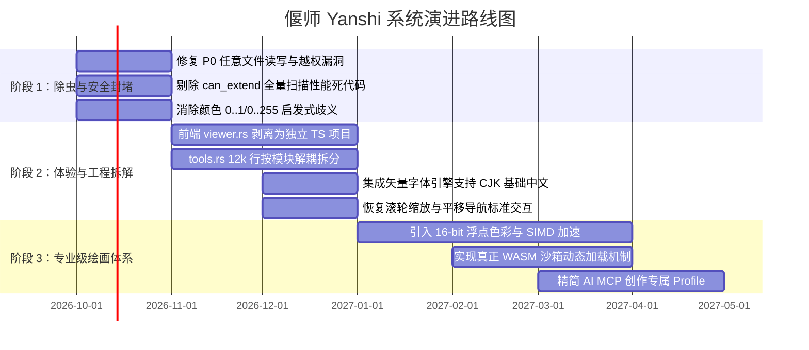

# 偃师 Yanshi 代码审查报告（七）：专业绘画/作图软件定位与工程质量专项

**审查范围**：整体仓库架构、`README.md`、`README.zh-CN.md`、`docs/design/`（权威设计文档与万行实现笔记）、`crates/yanshi-server/src/tools.rs`（12k 行）、`crates/yanshi-http/src/viewer.rs`（7.8k 行）、工程构建与测试规范。  
**审查定位**：立足于“专业数字绘画与设计软件”的产品定位（对标 Krita / Photoshop / Procreate / Figma），深度诊断产品能力的缺失边界，剖析代码工程债务、设计与实现偏离，并制定清晰的演进战略。

---

## 目录

1. [产品定位与核心差异化矩阵](#1-产品定位与核心差异化矩阵)
2. [与专业数字绘图软件能力对标全景](#2-与专业数字绘图软件能力对标全景)
3. [设计文档声称与实际代码实现的重大偏离](#3-设计文档声称与实际代码实现的重大偏离)
4. [工程质量与代码异味（Code Smells）诊断](#4-工程质量与代码异味code-smells诊断)
   - [4.1 超大单文件失控：上万行代码债务](#41-超大单文件失控上万行代码债务)
   - [4.2 盲目执念“零依赖”带来的巨大质量反噬](#42-盲目执念零依赖带来的巨大质量反噬)
   - [4.3 README 与代码注释的口语化与情绪化叙事](#43-readme-与代码注释的口语化与情绪化叙事)
   - [4.4 CI 自动化降级与测试覆盖守卫缺失](#44-ci-自动化降级与测试覆盖守卫缺失)
5. [三阶段落地演进路线图](#5-三阶段落地演进路线图)

---

## 1. 产品定位与核心差异化矩阵

偃师的定位是 **AI 原生、可协作、基于不可变时序事实的图像创作引擎**。它并不寻求复刻一个传统的单机桌面绘图软件，而是建立一个让 AI Agent 与人类创作者在同一张画布上无缝对话的统一基础设施。

### 核心差异化优势（护城河）
1. **只追加原子日志（Append-only Atom Log）**：任何一笔、一次移动、一个滤镜都是不可篡改的时序事实，天然支持无限回溯、分支演进与审计。
2. **纯计算内核无头化（Headless Engine）**：解耦界面与渲染，同一套内核可在服务端原生跑批量任务，亦可编译为 WASM 在浏览器跑乐观渲染。
3. **结构化与自然笔触并存**：兼具矢量几何图元（Rect, Ellipse, Polygon）与自由光栅笔刷（Hokusai/MyPaint/介质插件）。

---

## 2. 与专业数字绘图软件能力对标全景

下表系统性对照了专业数字艺术制作管线对软件的能力要求：

| 功能维度 | 工业基准（Photoshop / Krita / Procreate） | 偃师 Yanshi 当前工程现状 | 评级 |
|---|---|---|:---:|
| **色彩深度** | 16-bit 整数 / 32-bit 浮点 HDR | 强制截断到 8-bit sRGB，大渐变存在明显色带 | **不达标** |
| **色彩空间** | ICC Profile 色彩管理、Display P3、印刷 CMYK | 无任何 ICC 处理，无 CMYK 转换，色彩空间硬编码 | **不达标** |
| **文字系统** | OpenType/TrueType、多语言 CJK、富文本、字距排版 | 仅 5×7 ASCII 点阵字符，**所有中文强制变问号 `?`** | **严重残缺** |
| **行业交换** | 分层 PSD / TIFF 导入与无损导出 | PSD 仅单层扁平图只读导入，**无法导出 PSD** | **严重残缺** |
| **手感与交互** | 120~240Hz 采样、倾斜角/旋转角、自适应压感曲线 | 丢弃子采样点，无倾斜角支持，滚轮缩放被吞没 | **体验极差** |
| **图层体系** | 无限嵌套文件夹组、穿透混合、剪贴蒙版、智能对象 | 仅扁平列表，**代码显式拒绝组嵌套**，UI 无法折叠 | **基础可用** |
| **滤镜与效果** | 液化、内容识别、非破坏性智能滤镜、频域分离 | 实现了部分基础滤镜，但液化等高级图元跳过不画 | **未闭环** |
| **AI 协作** | 生成式填充、语义分割感知、多轮上下文协同 | 提供 114 个底层 MCP 工具，但缺乏高层视觉反馈闭环 | **体系初具** |

---

## 3. 设计文档声称与实际代码实现的重大偏离

项目宣称“以 `docs/design/yanshi-v1.0-draft4.md` 为权威设计文档，代码不得与之静默分叉”。然而深入审查发现，实现与设计存在多处实质性割裂：

1. **组嵌套与派生图元（设计 §9.2 / §9.3）**：
   - *设计声称*：对象组支持无限嵌套，且具备递归派生解析与循环检测机制。
   - *代码实况*：[`crates/yanshi-server/src/tools.rs:3830`](file:///home/crow/yanshi/crates/yanshi-server/src/tools.rs#L3830) 中显式硬编码：“组对象的成员不能是组，这里显式拒绝，组嵌套属于下一步”。
2. **开放 WASM 介质沙箱（设计 §11.1）**：
   - *设计声称*：介质是独立 WASM 插件沙箱，动态加载第三方物理仿真着色器。
   - *代码实况*：服务端原生环境根本未集成 WASM 解释器，而是将 6 个官方插件以原生 C ABI 静态写死进二进制（见 `yanshi-medium-host` 审查），第三方插件无法动态热插拔。
3. **语义工具组 Semantic Tools（设计 §10.2）**：
   - *设计声称*：包含针对 AI 的语义构图指引工具。
   - *代码实况*：在 `--profile all` 中明确剔除 semantic，文档注明“只预留不开发”。

---

## 4. 工程质量与代码异味（Code Smells）诊断

### 4.1 超大单文件失控：上万行代码债务

仓库存在数个体积极其骇人的单一源码文件，严重违反单一职责原则（SRP）：
- `crates/yanshi-server/src/tools.rs`：**12,235 行**！包含了 114 个工具的所有参数定义、Schema 生成、权限检查、参数提取、工具分发、测试辅助。任何微小改动都会引发数千行文件的重编译。
- `crates/yanshi-http/src/viewer.rs`：**7,864 行**！整套单页 Web 应用（HTML 标记、CSS 样式、几千行交互 JavaScript）全部塞在一个 Rust 字符串常量中，没有任何静态类型检查（TypeScript）和代码高亮。
- `docs/design/implementation-notes.md`：**11,432 行**！充斥着数十轮开发过程中的推演草稿、临时假设和历史日志，严重稀释了核心设计规范的权威性。

### 4.2 盲目执念“零依赖”带来的巨大质量反噬

项目将“不引入外部第三方 crate”作为核心卖点，但自行重新实现了大量工业级轮子：
- 手写 HTTP/1.1 协议解析器 -> 引发 Slowloris 慢速拒绝服务风险 [SEC-005]；
- 手写文件导出与路径拼接 -> 产生致命的任意文件覆盖重大安全漏洞 [SEC-001]；
- 手写 ASCII 点阵文字光栅化 -> 导致中文无法显示 [RND-001]；
- 手写 PSD 压缩与解码器 -> 导致功能极度受限且不支持写入 [RND-005]；
- 手写 SHA-1、Base64 与 Tar 打包器 -> 增加维护负担。

**工程结论**：密码学哈希、标准网络协议与专业排版引擎是高度复杂的领域。在安全边界与基础能力上盲目重复造轮子，非但没有降低风险，反而引入了多项 CVE 级的高危漏洞。

### 4.3 README 与代码注释的口语化与情绪化叙事

`README.md` 与 `README.zh-CN.md` 体积超过 50KB，但绝大部分篇幅并非面向使用者的结构化文档，而是以大量符号“✓”、“✗”、“真实用户报告让我抓到这个 bug”、“我上一轮被实测否掉”构成的长篇对抗性日记。这使得新接入的开发者和技术决策者极难快速获取 API 手册与安装部署指引。

### 4.4 CI 自动化降级与测试覆盖守卫缺失

代码注释中提及：“因为全局配置冲突，GitHub Actions 已按用户要求改成手动触发”。这意味着关键的长任务集成测试失去了主干合流的自动门禁守卫，本地修改后极易引发潜在的静默回归。

---

## 5. 三阶段落地演进路线图

### 阶段 1：安全加固与致命除虫（立即执行）
1. 封堵 `export_png`、`export_project` 的任意路径写入漏洞，实行沙箱隔离。
2. 修复 `IncrementalFolder::can_extend` 中的 O(N) 死循环逻辑。
3. 规范 MCP 协议层与颜色解析契约，消除暗色被放大 255 倍的陷阱。

### 阶段 2：工程解耦与核心体验修复（短期，1~2 个月）
1. 将 `viewer.rs` 剥离出 Rust 仓库，建立标准 TypeScript 前端工程，修复 `wheel` 吞没 Bug，重构画布渲染循环消除卡顿。
2. 将 `tools.rs` 拆解为独立的子模块（`tools/draw.rs`、`tools/layer.rs`、`tools/admin.rs` 等）。
3. 集成轻量级纯 Rust 矢量字体光栅化器，彻底解决中文乱码与变问号问题。

### 阶段 3：专业绘画体系与 AI 深度整合（中长期，3~6 个月）
1. 引入 16-bit 浮点管线与 SIMD/多线程并行合成，支持专业插画 4K 创作。
2. 在服务端实现真正的轻量 WASM 沙箱，解除全局 `MEDIUM_LOCK`，支持动态物理介质。
3. 构建面向 AI Agent 的高层视觉反馈机制（ROI 切片、结构化图层深度树、视觉重心分析）。
